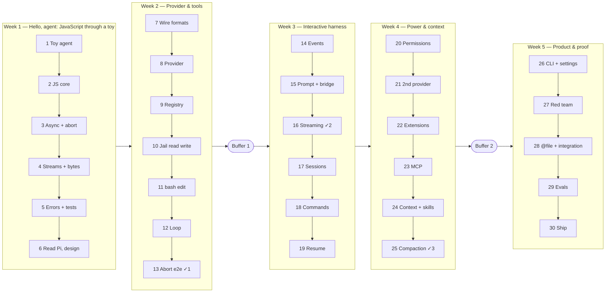

# Build an Agent Harness — 30 Days, JavaScript, From Scratch

By the end of **Day 1** you will have a working AI agent in about 70 lines of JavaScript. It reads your question, decides to run a shell command, asks your permission, runs it, and answers from the result.

Over the next 29 days you turn that toy into a real **terminal coding agent**, the same kind of program as Claude Code, Codex CLI or Pi, built by you with no agent framework:

```
you> what does src/greet.js export? and add a farewell() next to it
  ⚙ read {"path":"src/greet.js"}
  ⚙ edit {"path":"src/greet.js", …}   allow? [y/N/a] y
agent> greet.js exports greet(name). I added farewell(name) below it — it returns "Goodbye, <name>!".
you> /resume                                    ← sessions survive restarts
you> @notes.txt summarise this                   ← attach files
```

It streams tokens and the model's thinking, runs tools behind an approval gate with permission rules, saves sessions you can resume, compacts long conversations, loads extensions and **MCP servers**, follows project instructions in `AGENTS.md`, uses **Agent Skills**, and ships with an eval suite. Along the way you learn the JavaScript it is written in.

**Contents:** [Who this is for](#who-this-is-for) · [How the course works](#how-the-course-works) · [The 30-day plan](#the-30-day-plan) · [Environment & course model](#environment--course-model) · [Course tests & solutions](#course-tests--solutions) · [Canonical contracts](#canonical-contracts) · [Checkpoints](#checkpoints) · [Glossary](#glossary) · [Troubleshooting](#troubleshooting) · [Reading list](#reading-list) · [Pi reference](#reference-pis-architecture) · [After the course](#after-the-curriculum)

---

## Who this is for

- You can program (the contrast notes assume some C/C++ or Python), and you have done **intro-level JavaScript**: variables, functions, simple syntax.
- You have not shipped JavaScript. Week 1 fills the gaps: closures, `this`, the event loop, `async`/`await`, generators, streams, and bytes versus strings. You learn each one **by upgrading your toy agent**, not with throwaway drills.
- Days vary in length, and two optional **buffer days** give you room to catch up.

You will finish at an intermediate level in JavaScript and harness engineering, and you will have touched the advanced topics: stream assembly, compaction invariants, plugin trust boundaries, prompt-injection defence, and eval design.

## How the course works

**Every day has the same shape:**

| Section | What it gives you |
|---|---|
| **By tonight** | What will work at the end of the day, usually with a short transcript |
| **Why it matters** | The real-world problem the day solves |
| **Concepts** | Plain-language explanations, a diagram, and the JavaScript you need |
| **Build** | Guided steps with starter code. Core steps first, then optional Stretch |
| **Check** | The day's **course tests** plus a live demo you run yourself |
| **Stuck?** | Collapsible hints, from a gentle nudge to the near-answer |
| **Common mistakes**, **Self-check**, **Further reading** | Catch silent misunderstandings; go deeper |

**Rules of thumb**
1. Read the whole day before you code.
2. Do **Core** first. **Stretch** never blocks a later day.
3. Make the day's course tests pass. They are the spec ([how](#course-tests--solutions)).
4. Run the day's live demo. Seeing your agent do something new is the point.
5. **Commit every day**: `git commit -m "day-07: wire captures + message schemas"`. Day 30 reviews this history.
6. Checkpoints (Days 13, 16, 25) gate the next phase. If one is red, use the next buffer day to fix it.

### Something works every few days

| Week | Days | What you can *see* working |
|---|---|---|
| 1 | 1–6 | **Day 1: a working toy agent.** Day 3: Ctrl+C aborts it. Day 4: it streams tokens and thinking live. Day 5: green tests. Day 6: your design becomes an executable check of the loop's events |
| 2 | 7–13 | Real wire captures, a provider with readable error messages, jailed file tools, `edit` changing real files. **Day 12: your real loop runs a tool you approved.** Day 13: abort kills a running `sleep 30` |
| 3 | 14–19 | **Day 15: you chat with your own harness.** Day 16: it streams. Day 18: slash commands. Day 19: it remembers you across restarts |
| 4 | 20–25 | Day 20: permission rules ("always allow `git status`"). Day 21: a second provider. Day 22: plugins. **Day 23: an MCP server's tools show up in your agent.** Day 24: skills and AGENTS.md. Day 25: long chats compact |
| 5 | 26–30 | Day 26: a real CLI (`agent-harness -p "…"`). **Day 27: you attack your own agent.** Day 28: `@file` attachments. Day 29: an eval table across models. Day 30: you ship it |

---

## The 30-day plan



| Day | File | You build | JavaScript focus | Demo tonight |
|----:|------|-----------|------------------|--------------|
| 1 | [day-01](day-01.md) | Setup + a 70-line toy agent | ESM, `fetch`, top-level `await` | The agent runs a command you approved |
| 2 | [day-02](day-02.md) | Refactor the toy into modules | values, closures, `this`, classes vs factories, JSDoc | Same agent, clean modules |
| 3 | [day-03](day-03.md) | Ctrl+C aborts the toy; first course tests | event loop, promises, `AbortController` | Ctrl+C stops an answer, a command or a question |
| 4 ⚠ | [day-04](day-04.md) | Streaming toy + `src/shared/ndjson.js` + `src/tools/truncate.js` | generators, streams, `Buffer` vs strings | Tokens and thinking stream live |
| 5 | [day-05](day-05.md) | Errors, `node:test`, `src/cli/args-parser.js` (the toy's first flags) | errors, validation, DI | All course tests green |
| 6 | [day-06](day-06.md) | Read Pi, design your harness, executable event protocol | reading TypeScript, state machines | Your protocol's tests pass |
| 7 | [day-07](day-07.md) | Wire captures + message schemas | JSDoc typedefs | Your own captures in `fixtures/` |
| 8 | [day-08](day-08.md) | `OllamaProvider.chat()` + error taxonomy + real context limit | classes, `fetch`, `cause` | `node scripts/smoke-provider.js` |
| 9 | [day-09](day-09.md) | Tool contracts + registry, a tool-description experiment | `Map`, validation | Your measured table: clear vs vague descriptions |
| 10 | [day-10](day-10.md) | Path jail (with symlinks, dangling ones too), `read`, `write` | `fs/promises`, `path` | `read` refuses `../etc/passwd` |
| 11 ⚠ | [day-11](day-11.md) | `bash` (nothing outlives a command), `edit`, threat model v1 | `child_process`, signals, process groups | The toy runs commands through the real `bash` tool |
| 12 ⚠ | [day-12](day-12.md) | `AgentLoop` + minimal approval | async control flow | **Your real loop runs a tool you approved** |
| 13 | [day-13](day-13.md) | Abort + `ScriptedProvider` + e2e — **Checkpoint 1** | AbortSignal patterns | Ctrl+C kills `sleep 30` mid-run |
| — | [buffer-1](buffer-1.md) | Catch up, repair, or challenge | — | — |
| 14 | [day-14](day-14.md) | Canonical events, `EventBus`, printer | listener registries | Coloured event trace |
| 15 ⚠ | [day-15](day-15.md) | `PromptUI` + `UIBridge` | `readline`, lifecycles | **You chat with your own harness** |
| 16 | [day-16](day-16.md) | `chatStream` + parity — **Checkpoint 2** | async generators | Live streaming harness |
| 17 | [day-17](day-17.md) | JSONL sessions + `SessionManager` | `fs` appends, atomic writes | Session files on disk |
| 18 | [day-18](day-18.md) | Slash commands + `/model` | dispatch tables | `/help`, `/model` |
| 19 | [day-19](day-19.md) | Auto-save, `/resume`, continuity | state machines | It remembers "blue" after a restart |
| 20 | [day-20](day-20.md) | Approval gate + permission rules & modes | promise-per-id | "Always allow `git status`" |
| 21 | [day-21](day-21.md) | OpenAI-compatible provider (SSE, fragmented args) | incremental parsing | Same harness, second provider |
| 22 | [day-22](day-22.md) | Extensions with a trust boundary | dynamic `import()` | A plugin tool appears |
| 23 | [day-23](day-23.md) | MCP client (stdio, 2026-07-28 spec) | JSON-RPC, child processes | An MCP server's tools in your agent |
| 24 | [day-24](day-24.md) | Token budget, system prompt, AGENTS.md, Skills, caching | estimation | A skill loads on demand |
| 25 | [day-25](day-25.md) | Compaction with invariants — **Checkpoint 3** | invariants, trees | A long chat compacts and keeps going |
| — | [buffer-2](buffer-2.md) | Catch up, repair, or challenge | — | — |
| 26 | [day-26](day-26.md) | CLI, secure settings layers, logging, packaging | process lifecycle | `agent-harness -p "…"` |
| 27 | [day-27](day-27.md) | **Red-team day**: attack your own agent | — | Your attack report |
| 28 | [day-28](day-28.md) | `@file` refs, Tab completion, multi-line, integration suite | parsing, fs walks | `@notes.txt summarise this` |
| 29 | [day-29](day-29.md) | Evals: trials, pass@k, model comparison | measurement | Your eval table |
| 30 | [day-30](day-30.md) | Demo, docs, capstone — **graduate** | shipping | Offline demo + a capstone feature |

**Heavier days** are marked ⚠ in their header (Days 4, 11, 12, 15, 16, 20, 23, 25), so plan a longer sitting. Day 6 is deliberately lighter: it is week 1's catch-up room.

---

## Environment & course model

| Need | Version | Why |
|---|---|---|
| **Node.js** | **24 LTS** (22 is the minimum) | Node 20 reached end-of-life on 2026-04-30. Node 24 is Active LTS until April 2028. `node --test`, `AbortSignal.any`, `fetch` and `readline/promises` are all built in |
| **Ollama** | recent; verified on **0.32.0**, re-checked on 0.35.0 and 0.35.1 | Runs models locally. No API keys, no cost |
| **git** | any | One commit per day |
| Disk / RAM | about 4 GB disk, 8 GB+ RAM | For the course model |

### The course model

This is the one place the model is chosen. Code reads it from `src/shared/constants.js` (`DEFAULT_MODEL`), and later from your settings file.

| Your machine | Model | Pull |
|---|---|---|
| 8–16 GB RAM (**default**) | `qwen3.5:4b` | `ollama pull qwen3.5:4b` |
| 16 GB+ RAM | `qwen3.5:9b` | `ollama pull qwen3.5:9b` |
| Anything else | any model whose `/api/show` `capabilities` include `"tools"` (browse [ollama.com/search?c=tools](https://ollama.com/search?c=tools)) | — |

Models without the `thinking` capability work too: the provider stops sending `think` after Ollama refuses it once (Day 8). But **size matters more than the capability list**. We ran `llama3.2:1b` and `qwen2.5:0.5b` through the finished harness: they echoed tool definitions back as text, invented arguments and file contents, and looped until `maxTurns`. The harness handled every one of those correctly; the models just weren't usable agents. Use about 4B parameters or more.

`qwen3.5:4b` was verified on 2026-10-01 against Ollama 0.32.0. It handles tool calls, including parallel calls, plus thinking, streaming, and both the native and OpenAI-compatible APIs. The real responses are saved in [`course-assets/captures/ollama-0.32/`](course-assets/captures/ollama-0.32/). If you switch models, re-capture on Day 7: **your capture is the ground truth.**

> **The one Ollama fact that bites everyone:** Ollama runs models with a **4096-token** window by default on machines with less than 24 GiB of VRAM, whatever the model supports. Overflow is **silent**: no error, the start of the prompt (your system prompt and tool definitions) is simply dropped. We verified it. With an 11k-token prompt the server returned HTTP 200, processed only 2,050 tokens, and the model forgot its instructions. With `options.num_ctx: 16384` it read everything. **Your harness sends `num_ctx` on every request** (Day 1 onward), and budgets against `min(num_ctx, model maximum)` (Days 8, 24). From Day 8 it also sends `num_predict`, because Ollama's default output limit is *unlimited*: a runaway model never stops. Check what is actually running with `ollama ps`.

---

## Course tests & solutions

**Course tests** (`course-tests/day-NN/`) are acceptance tests for each day's modules: the toy in week 1, then `src/`. They are the precise spec, they need no network, and they turn green when you are done.

```bash
# inside your agent-harness project, from Day 3 on:
mkdir -p tests/course
cp ../agent-harness-curriculum/course-tests/day-03/*.test.js tests/course/
node --test                        # runs every *.test.js under the project, yours and the course's
node --test tests/course/day03-*   # just today's
```

`node --test` takes files or glob patterns, not directories: on Node 22+, `node --test tests/course/` fails with `Cannot find module`.

They import your code from `../../src/...`, so the [project structure](#project-structure-target) matters. Write **your own** tests too (each day asks for some). Course tests check the contract; yours check your understanding.

**Reference solutions** (`solutions/`) are snapshots of a complete, tested implementation:

| Folder | State | Use it when |
|---|---|---|
| `solutions/toy/` | The toy agent: Day 1 single file, plus the Days 2–5 modules | You are stuck in week 1 |
| `solutions/checkpoint-1/` | End of Day 13 | Checkpoint 1 is red and a buffer day didn't fix it |
| `solutions/checkpoint-2/` | End of Day 16 | Same, for Checkpoint 2 |
| `solutions/checkpoint-3/` | End of Day 25 | Same, for Checkpoint 3 |
| `solutions/final/` | End of Day 30 | After you finish, to compare designs |

> **Spoiler policy.** Try the day's **Stuck?** hints first, then read *one file* of the solution, then close it and write your own. Copying a checkpoint wholesale is allowed. It is better than quitting, but note it in your daily commit message.

## Dependency policy

**Build the agent core yourself.** No LangChain, no agent framework, no coding-agent SDK, no MCP SDK.

| When | Allowed | Why |
|---|---|---|
| Days 1–8 | Node built-ins only | Learn `fetch`, modules, tests, async |
| Day 9+ | Optional JSON Schema validator (e.g. Ajv) | Only after the hand-rolled checker works |
| Any day | `typescript` as a dev dependency for `tsc --checkJs` (Day 5 stretch) | Type-check your JSDoc |
| After Day 30 | A TUI library, an MCP SDK, anything | You will know what it does for you |

## Project structure (target)

```
agent-harness/
├── toy/                       # Days 1–4: the toy agent (kept as a museum piece)
├── src/
│   ├── agent/                 agent-loop.js · agent-schemas.js · approval-gate.js (20) · permissions.js (20)
│   ├── provider/              ollama.js (8) · scripted.js (13) · openai-compatible.js · index.js (21)
│   │                          parse-arguments.js (8) · tool-call-assembler.js (16)
│   ├── tools/                 tool-registry.js (9) · workspace-path.js (10) · truncate.js (4)
│   │   └── builtin/           index.js · read.js · write.js (10) · bash.js · edit.js (11)
│   ├── events/                event-bus.js (14)
│   ├── ui/                    printer.js (14; sanitizeForTerminal 27) · prompt-ui.js (15)
│   │                          file-refs.js · file-finder.js · completer.js (28)
│   ├── session/               jsonl-utils.js · session-manager.js (17)
│   ├── commands/              registry.js · builtin/index.js (18)
│   ├── extensions/            loader.js · trust.js (22)
│   ├── mcp/                   mcp-client.js · mcp-tools.js (23)
│   ├── context/               token-estimator.js · budget.js · project-instructions.js · skills.js
│   │                          system-prompt-builder.js (24) · compaction.js (25)
│   ├── config/                paths.js (17) · settings.js · logger.js · error-handler.js (26)
│   ├── cli/                   args-parser.js (5) · main.js (15 → 26)
│   ├── shared/                constants.js · errors.js (5) · ndjson.js (4) · message-schemas.js (7)
│   │                          tool-schemas.js (9) · events.js (14) · session.js (17) · commands.js (18)
│   │                          extension.js (22) · sse.js (21)
│   ├── bridge.js              UIBridge (15)
│   ├── app.js                 createApp(): wires everything (15, grows)
│   └── index.js               public API (26)
├── scripts/                   smoke-provider.js (8) · smoke-loop.js (12) · trace.js (14) — live checks, never shipped
├── tests/                     your tests;  tests/course/ = copied course tests (3+);  tests/helpers/event-protocol.js (6);  tests/integration/ (28)
├── fixtures/                  your Ollama captures (7), golden session (17), compaction entry (25)
├── examples/                  extensions/ (22, 30) · mcp/ (23) · redteam-repo/ (27) · evals/ (29) · demo.js (30)
├── notes/                     daily notes · tool-security.md (11 → 27) · redteam-report.md (27)
├── docs/                      architecture.md · extending.md · api.md (30)
└── package.json               "type": "module"
```

---

## Canonical contracts

These are fixed early and reused everywhere. The day files point back here. **Do not invent a second vocabulary.**

### Canonical event list

Defined once in `src/shared/events.js` (Day 14). The UI, bridge, loop, extensions and tests all import from there.

**Agent / core → bus**

| Event | When | Payload |
|---|---|---|
| `session_start` | Session created or resumed | `{ sessionId }` |
| `session_shutdown` | Quit / unload | `{ sessionId }` |
| `agent_start` | `run()` begins | `{ userMessage }` |
| `turn_start` | About to call the provider | `{ turn }` |
| `turn_end` | Provider call and its tools finished | `{ turn, usage? }` |
| `thinking_delta` | Streaming reasoning chunk | `{ content }` |
| `text_delta` | Streaming answer chunk | `{ content }` |
| `tool_call_start` | About to execute a tool | `{ id, name, arguments }` |
| `tool_approval_request` | Tool needs a human decision | `{ id, name, arguments }` |
| `tool_approval_result` | Human (or timeout/abort) decided | `{ id, approved, remember? }` |
| `tool_call_end` | Tool finished (success or error) | `{ id, name }` |
| `tool_result` | Result ready for history | `{ id, name, content, isError }` |
| `agent_end` | `run()` finished, on every exit path | `{ response, turns, aborted }` |
| `compaction` | History was compacted | `{ dropped, kept }` |
| `error` | Recoverable or fatal error | `{ message, cause? }` |
| `command_run` | Slash command executed | `{ name, args }` |

**UI → bus:** `user_message` `{ content }`, `abort` `{}`, `command` `{ line }`.

There are **no aliases**. Extensions subscribe to these exact names. Pi uses a different vocabulary (see [Pi's architecture](#reference-pis-architecture)). Ours splits a tool call into start / end / result, and gives thinking its own event.

### Message and tool shapes

JSDoc lives in `src/shared/message-schemas.js` (Day 7) and `src/shared/tool-schemas.js` (Day 9).

- **Roles (internal):** `system`, `user`, `assistant`, `tool_result`. How a role maps onto the wire is each provider's private business.
- `AgentMessage` = `{ role, content, thinking?, toolCalls?, toolCallId?, toolName?, isError?, usage? }`
- `ToolCall` = `{ id, name, arguments, parseError? }`:
  - **`id`** is the server's id when it sends one (Ollama 0.32 does: `call_…`). Otherwise the provider generates one. It is never empty.
  - **`arguments`** is always a plain object inside the harness. Providers parse strings at the boundary.
  - **`parseError`** marks wire arguments that were not valid JSON.
- `ToolDefinition` = `{ name, label?, description, parameters /* JSON Schema */, execute(args, { signal }), needsApproval?, readOnly? }`
- `ToolResult` = `{ content, isError, details? }`. **Tool failures are results, not exceptions.**
- `ChatResponse` = `{ content, thinking?, toolCalls, usage?, model, finishReason? }`. `usage` = `{ promptTokens, completionTokens }`.
- `StreamEvent` (from `chatStream`) is one of:
  - `{ type: 'text_delta', content }`
  - `{ type: 'thinking_delta', content }`
  - `{ type: 'tool_call_start', id, name }`
  - `{ type: 'tool_call_delta', id, argsDelta }`
  - `{ type: 'done', response }`, where `response` is the fully assembled `ChatResponse`
- **Provider interface:** `chat(messages, tools, { signal })`, `chatStream(messages, tools, { signal })`, `listModels()`, `getModelInfo(name?)` → `{ name, contextLimit, maxContext, capabilities }`, `setModel(name)`, `model`.

### Tool output truncation contract

The default cap is **32 KiB** of UTF-8. `@file` attachments are capped at 50 KiB per file **and** share a budget of about 40% of the context window (Day 28), because they sit in the newest message, which compaction never touches. A truncated result reads:

```
<actual prefix of output>
...[truncated: showing 32768 of 120004 bytes. Use read with offset/limit or a narrower command to see more.]
```

- Truncation happens **in the harness**. Counts are UTF-8 **bytes** (`Buffer.byteLength`, `Buffer.subarray`, never `String.slice`), and a cut never splits a character (Day 4).
- The advice after the counts is a parameter (`truncateText(text, max, { hint })`). Only suggest tools the model actually has: the week 1 toy has no `read`, so it says `Run a narrower command to see more.`
- Set `details.truncated`, `details.byteLength` and `details.shownBytes`.
- **Command output keeps the head *and* the tail** (`keep: 'head+tail'`, Day 11), because test runners and compilers print their errors and summaries last. The marker sits in the middle: `...[truncated: showing the first 16384 and the last 16384 of 120004 bytes. Use a narrower command (grep, head, tail) to see more.]`
- Never drop the middle silently: the model hallucinates output it never saw.

### Tool-pair history invariant

An `assistant` message with `toolCalls` and **all** of its `tool_result` messages are one unit. They are kept, dropped, or folded into a compaction record **together**, and the latest user message is never dropped.

```json
{ "role": "user", "content": "What files are in /tmp?" }
{ "role": "assistant", "content": "", "toolCalls": [{ "id": "call_1", "name": "bash", "arguments": { "command": "ls /tmp" } }] }
{ "role": "tool_result", "toolCallId": "call_1", "toolName": "bash", "content": "a.txt\nb.txt", "isError": false }
```

Abort keeps the trio too. If the run aborts before a tool runs, its result is still appended (`isError: true`, content `Skipped: run aborted`). After an interrupted run, history gets one more message, `{ role: 'user', content: '[Request interrupted by user]' }`, so the model is less likely to pick up the task you stopped (Day 15). A run that fails partway is saved up to its last complete tool pair.

### Approval & permissions

- **Day 12 (minimal):** `AgentLoop` takes an `approve(call, tool, { signal })` callback. With **no** approver attached, `needsApproval` tools are **denied** (fail closed).
- **Day 20 (full gate):** a permission policy answers `allow`, `deny` or `ask` per call.
  - **Rules:** `"read"`, `"bash(git status)"`, `"bash(npm test*)"`. `*` is a wildcard on the tool's main argument. A **path** argument is normalized against the workspace first (so `./x`, `a/../x` and absolute paths can't dodge a rule), and a **wildcard `bash` allow** rule never matches a command with a shell operator (`; && | \` $( > <`), so `bash(npm test*)` can't pre-approve `npm test; curl … | sh`. **Deny rules always win** (and are not narrowed this way) — but they stop accidents, not a determined command; they are a guard-rail, not a sandbox.
  - **Modes:**
    - `default` asks for every `needsApproval` tool.
    - `read-only` denies anything that is not `readOnly`.
    - `accept-edits` allows `write`/`edit` and asks for `bash`.
    - `yolo` allows everything except deny rules.
  - **The ask path:**
    1. `tool_approval_request` → y/N/a prompt showing the **whole** request, never cut short → `tool_approval_result` for the same `id` (`Map<id, resolver>`).
    2. `a` adds a session rule, scoped as narrowly as the call allows (exact command for `bash`, exact path for `write`/`edit`, tool name otherwise), and the prompt says what it will cover.
    3. **Timeout 120 s → deny**; **abort → deny**.
    4. A human "no" (or timeout/abort) appends `ToolResult { isError: true, content: 'User denied <name>' }`; a policy refusal reads `Denied <name> (<reason>)`. The approver marks policy refusals with `by: 'policy'`; the loop routes on that field, never on the reason's text.
  - **Non-interactive (`-p`) fails closed:** `ask` becomes deny unless you pass `--auto-approve` (mode `yolo`) or allow rules. A harness that silently runs commands because nobody was watching is a liability.

### Trust boundaries

| Boundary | Rule |
|---|---|
| **Workspace jail** | Every file path resolves under the workspace root through `src/tools/workspace-path.js`: a lexical check (`..` as a path segment) **and** a realpath check against symlinks, dangling ones included. Known gap: a check-then-use race (TOCTOU) |
| **`bash` processes** | Nothing a command starts outlives the call or the harness: the whole process group is killed on timeout, abort, leftover background processes and exit. The model's `timeout` is capped. Known gap: a command can leave its group on purpose (`setsid`); only a sandbox stops that (Day 11) |
| **Tool arguments & tool output** | Untrusted data. They may contain prompt injection, and they never change what the harness permits |
| **Project config** (`.agent-harness/settings.json`) | Repo-controlled, so it may only **restrict**. It can never set `autoApprove`, provider URLs, `permissions.allow`, a permission mode looser than `read-only`, or `mcpServers`; it may only *lower* `contextWindow` (memory on your machine) and `maxTurns`; and choosing the model is announced (Day 26) |
| **Your terminal** | Text from tools, the model, file names, settings keys and servers is untrusted and may carry escape sequences. It is sanitized where it leaves the program (the `Printer`, `PromptUI.ask`, the CLI's stderr, and `-p`'s stdout when it's a terminal), not at each source (Day 27) |
| **Project extensions** (`.agent-harness/extensions/`) | Repo-controlled **code**. Load only after a trust prompt or `--allow-project-extensions`. The trust decision is stored in **your** config (`~/.config/agent-harness/trusted-projects.json`), never in the repo, and pinned to a hash of every file in the extensions tree — imported helpers included, so a later change re-asks (Day 22) |
| **`AGENTS.md` / `CLAUDE.md`** | **Project instructions**, followed for conventions (build commands, style). They rank below the system prompt and the user, and **cannot grant permissions**. The approval gate, permission rules and jail enforce policy. Prompt text doesn't (Day 24) |
| **MCP servers** | Starting one runs code, so they are configured in global settings only, and the server is spawned with a minimal environment (a safe baseline plus its configured `env`), never your whole `process.env`. Every MCP tool `needsApproval` by default, and their descriptions are untrusted (Day 23) |
| **The lethal trifecta** | Private data + untrusted content + a way to send data out = exfiltration risk. Day 27 attacks your harness through exactly this |

Wrapping untrusted text in "this is data" markers helps a little, but it is **not** a defence. Models can still follow injected instructions. Capability limits (approval, permissions, the jail, no network) are the defence.

### Storage and settings

- **Global:** `path.join(os.homedir(), '.config', 'agent-harness', …)` on every OS, never a literal `~/` string. It holds `settings.json`, `sessions/`, `logs/`, `extensions/`, `skills/` and `trusted-projects.json`.
- **Sessions** are private (folders `0o700`, files `0o600`), because they hold everything the tools printed. Each one records the folder it was started in, and resume only offers sessions from the current folder (Day 19).
- **Project:** `.agent-harness/settings.json`, `.agent-harness/extensions/` and `.agent-harness/skills/` (all repo-controlled, see above).
- **Precedence:** defaults ← global ← project (restrict-only) ← CLI flags. Last wins.
- **The settings shape (Day 26):**
  - `provider`, `ollamaUrl`, `openai.baseUrl`, `defaultModel`
  - `contextWindow` (sent as `num_ctx`), `think`
  - `maxTurns`, `streaming`, `autoApprove`, `systemPrompt`
  - `tools.enabled`, `permissions.{mode,allow,deny}`
  - `compaction.{enabled,contextLimit,keepMessages}`, `mcpServers`

### CLI flags (Day 26)

| Flag | Meaning |
|---|---|
| `-p/--print` | One-shot answer to stdout |
| `-c/--continue` | Continue this folder's last session |
| `--resume` | Pick one of this folder's sessions to resume |
| `--new` | Start a fresh session |
| `--model` | Model to use |
| `--provider` | Provider to use |
| `--system-prompt` | Extra system prompt text |
| `--extension` | Load an extension file (repeatable) |
| `--allow-project-extensions` | Load project extensions without the trust prompt |
| `--permission-mode` | `default`, `read-only`, `accept-edits` or `yolo` |
| `--auto-approve` | Same as `--permission-mode yolo` |
| `--no-tools` / `--tools a,b` | Disable tools / enable only these |
| `--verbose` (or `-V`) | Debug logging |
| `--script <file>` | Script for `--provider scripted` (tests, evals, the offline demo) |
| `-h/--help` | Usage |
| `-v/--version` | Version |

**`-v` is `--version`, never verbose.**

**Exit codes:** 0 ok · 1 runtime error · 2 usage or settings error · 3 no final answer (`maxTurns` ran out) · 4 answered, but tool calls were denied (nobody could approve them, or a rule or mode refused them) · 130 interrupted.

## Checkpoints

| Gate | After | You must have |
|---|---|---|
| 1 | Day 13 | Headless engine: tool loop, maxTurns, fail-closed approval, abort kills tools, course tests green with Ollama **stopped**, one live approved tool turn |
| 2 | Day 16 | Interactive streaming harness: live text and thinking, tool calls, Ctrl+C abort, prompt always comes back |
| 3 | Day 25 | Protocol stays valid: compaction keeps tool pairs whole and the latest user message; budget uses the *real* window |
| Graduation | Day 30 | All course tests green, eval table from real runs, red-team report, docs + offline demo shipped |

## Glossary

| Term | Meaning |
|---|---|
| **Agent harness** | The program between a user and an LLM. It runs the loop, executes tools *in your process*, manages history, enforces safety and renders the UI |
| **Turn** | One LLM response plus the tool calls/results that follow before the next LLM call |
| **Tool call / result** | The model's structured request to run a tool / the observation fed back (errors included) |
| **Tool pair** | An assistant tool-call message plus all of its tool results |
| **Provider** | Adapter between harness shapes and one LLM API's wire format |
| **Thinking** | Reasoning text a model emits before its answer (`message.thinking` in Ollama). Kept in history, shown dimmed, never treated as the answer |
| **`num_ctx`** | The context window Ollama allocates for a request. Default 4096 on most laptops. Send it explicitly |
| **Context window** | Max tokens per call: system prompt + tools + history + reply |
| **Prompt caching** | Servers reuse work for an unchanged prompt *prefix*. Ollama re-ran a 302-token prompt in 54 ms instead of 631 ms. Keep the prefix stable (Day 24) |
| **Session entry / active path** | One persisted record / the root→leaf chain the model actually sees (`getPath()`) |
| **Compaction** | Folding old active-path entries into one record so history fits the window, keeping tool pairs and the latest user message |
| **Approval gate / permission mode / rule** | y/N/a confirmation for risky tools / a preset policy / an allow or deny pattern like `bash(git status)` |
| **MCP** | Model Context Protocol: a standard JSON-RPC protocol for exposing tools to any harness. Revision `2026-07-28` is stateless |
| **Agent Skill** | A folder with a `SKILL.md` (name, description, instructions). The harness lists skills cheaply and loads one only when needed (progressive disclosure) |
| **AGENTS.md** | Project instructions for coding agents (build commands, conventions). Followed, but cannot grant permissions |
| **Prompt injection** | Untrusted text (a file, a web page, tool output) that tries to instruct the model |
| **Eval / pass@k** | A scripted task with a pass/fail checker / the chance that at least one of *k* attempts passes. pass^k means *all* k pass |
| **NDJSON / SSE** | Newline-delimited JSON (Ollama's native stream) / Server-Sent Events, `data:` lines (OpenAI-style streams) |
| **Fixture** | A captured real response used by tests |

## Troubleshooting

| Symptom | Likely cause | What to try |
|---|---|---|
| `ECONNREFUSED` to `:11434` | Ollama not running | `ollama serve`, or start the app |
| Model not found | Not pulled | `ollama pull qwen3.5:4b` |
| Model "forgets" its instructions or tools in long chats, **no error** | Ollama's default 4k window silently truncated the prompt | Send `options.num_ctx` (Day 1+), check `ollama ps`, and budget with `getModelInfo().contextLimit` (Day 8) |
| No tool calls ever | Model without tool support, or tools not sent | `ollama show <model>` must list `tools`; check `tools` in your request body |
| `<think>` tags inside `content` | Server didn't split reasoning out | Send `think: true` explicitly; capture again (Day 7) |
| Tool calls missing when streaming | You read tool calls from the final `done` chunk | Ollama sends each call in an *earlier* chunk; collect them as they arrive (Day 16) |
| Infinite tool loop | No maxTurns, or tool errors thrown instead of returned | Enforce `maxTurns`; return errors as results |
| `node --test tests/course/` fails with `Cannot find module` | Node 22+ takes files or globs, not directories | `node --test`, or `node --test tests/course/*.test.js` |
| Ctrl+C at a `[y/N]` question waits for Enter | The question wasn't given the run's signal | `rl.question(prompt, { signal })` (Day 3) |
| HTTP 400 `"<model>" does not support thinking` | `think: true` sent to a model without the thinking capability | The provider drops `think` for that model and retries (Day 8); so does the toy (Day 4) |
| `fetch failed` after exactly 5 minutes (`UND_ERR_HEADERS_TIMEOUT`) | A non-streaming reply that took over 300 s: Ollama's output limit is unlimited by default, so a runaway model never stops | The provider sends `num_predict` (default: the window) and names the timeout (Day 8); stream long answers |
| HTTP 500 `token repeat limit reached` / `error parsing tool call` | The model's output went wrong (a repetition loop, a malformed tool call), mostly with tiny models | Ask again or rephrase; use a bigger model (Day 8) |
| A tool call fails with `unexpected property '…'` | The model invented an argument the tool doesn't have | Working as intended: the model is told the allowed names and retries (Day 9) |
| A server or watcher the agent started (`npm run dev &`) is gone | By design: nothing a command starts outlives it (Day 11) | Run long-lived processes yourself, outside the agent |
| `the model saw only ~N of ~M prompt tokens` | The server cut the prompt to fit its window (silently, HTTP 200): a huge paste, a `/v1` server with a smaller window than you set, or too little room left | Send less, raise `contextWindow` (or the server's own, e.g. `OLLAMA_CONTEXT_LENGTH`), or `/compact` (Day 24) |
| `-p` exits **4** | It answered, but tool calls were denied (the warning says whether nobody could approve them or a rule or mode refused them); the answer can't reflect them | Opt in with `--auto-approve` or an allow rule, if you mean it, or change the rule or mode. For a text-only prompt, pass `--no-tools`: small models often reach for a tool they don't need (Day 26) |
| 400s from a hosted API after compaction | A tool pair was split | Day 25 invariant |
| Garbled terminal after a crash | readline not closed on an error path | One `shutdown()` path (Day 26) |
| Unexpected code ran at startup | Project extension auto-loaded | Trust prompt (Day 22) |
| A cloned repo made the agent stop asking before running commands | Project settings were allowed to loosen permissions | Restrict-only project layer (Day 26) |

## Reading list

Read these as the days ask for them; they are also good on their own.

- Thorsten Ball, [How to Build an Agent](https://ampcode.com/how-to-build-an-agent) (2025): the "LLM, a loop, and enough tokens" essay behind Day 1.
- Mario Zechner, [What I learned building an opinionated and minimal coding agent](https://mariozechner.at/posts/2025-11-30-pi-coding-agent): the design rationale for Pi (Days 6, 30).
- Anthropic, [Building effective agents](https://www.anthropic.com/engineering/building-effective-agents), [Writing effective tools for agents](https://www.anthropic.com/engineering/writing-tools-for-agents) and [Effective context engineering for AI agents](https://www.anthropic.com/engineering/effective-context-engineering-for-ai-agents) (Days 9, 24, 25).
- Simon Willison, [The lethal trifecta](https://simonwillison.net/2025/Jun/16/the-lethal-trifecta/) (Days 11, 24, 27).
- Ollama docs: [chat API](https://docs.ollama.com/api/chat), [tool calling](https://docs.ollama.com/capabilities/tool-calling), [context length](https://docs.ollama.com/context-length) (Days 7, 8, 16).
- [Model Context Protocol specification (2026-07-28)](https://modelcontextprotocol.io/specification/2026-07-28) (Day 23).
- [Agent Skills](https://agentskills.io/) and [AGENTS.md](https://agents.md/) (Day 24).
- MDN [JavaScript Guide](https://developer.mozilla.org/en-US/docs/Web/JavaScript/Guide) and the [Node.js API docs](https://nodejs.org/api/) (week 1, and always).

## Reference: Pi's Architecture

The workspace vendors **`reference/pi`** at package version **0.80.3**. It is read-only reference: study it on Days 6 and 30 and never import it.

- **`packages/agent`** (`@earendil-works/pi-agent-core`) is the agent loop. It has an `AgentEvent` union in `src/types.ts`, the loop in `src/agent-loop.ts`, and session storage in `src/harness/session/`. This is the closest analogue to our [canonical events](#canonical-event-list).
- **`packages/coding-agent`** (`@earendil-works/pi-coding-agent`) is the product: tools in `src/core/tools/`, `src/core/session-manager.ts` and `src/cli/args.ts`. A separate hook union in `packages/agent/src/harness/types.ts` includes `tool_call` and `tool_result`. Do not mix it up with `AgentEvent`.
- **`packages/tui`** (`@earendil-works/pi-tui`) is a terminal UI library with differential rendering, and a good post-course study target.
- **`packages/ai`**, **`packages/orchestrator`** and **`packages/pods`** also exist. None of them is the agent loop; skip them for this course.

**Vocabulary differences:** Pi's `AgentEvent` has `turn_start` / `turn_end`, streams through `message_update`, and splits tool execution into `tool_execution_start` / `_update` / `_end`. Ours uses `text_delta` / `thinking_delta`, `tool_call_start` / `tool_call_end` / `tool_result`, and adds approval and compaction events. When reading Pi, translate mentally. When writing extensions for *your* harness, use ours.

**Design differences worth knowing:** Pi deliberately ships without MCP support, sub-agents or a plan mode (see Mario's post). This course adds MCP on Day 23 because it is now the standard way to plug tools into harnesses. Both choices are defensible, and arguing them is part of Day 30.

## After the Curriculum

Day 30 asks you to pick one capstone. The rest make good next projects:

- **A full TUI**: raw mode, differential rendering, a multi-line editor (study `@earendil-works/pi-tui`).
- **Hosted providers**: Anthropic Messages and OpenAI Responses. Your `ScriptedProvider` seam already proves the interface.
- **OS-level sandboxing** for `bash`: macOS `sandbox-exec`, Linux bubblewrap or Landlock, or a container. This is what moves "approval" towards "containment".
- **Sub-agents**: a `task` tool that runs a fresh `AgentLoop` with its own context and returns a summary.
- **LLM-written compaction summaries** with re-entrancy guards (the Day 25 stretch, done properly).
- **An MCP server of your own**, so other harnesses can use your tools.
- **Evals that matter**: grow `examples/evals/` into a regression suite and track pass^k across models and releases.

See [CHANGELOG.md](CHANGELOG.md) for what changed in this edition and why.

## License

- **The written course** (`README.md`, the `day-*.md` and `buffer-*.md` pages, `self-check-answers.md` and `CHANGELOG.md`) is licensed under [CC BY 4.0](LICENSE-CONTENT). You may share and adapt it, with attribution.
- **The code** (`solutions/`, `course-tests/` and `course-assets/`) is licensed under the [MIT License](LICENSE).
