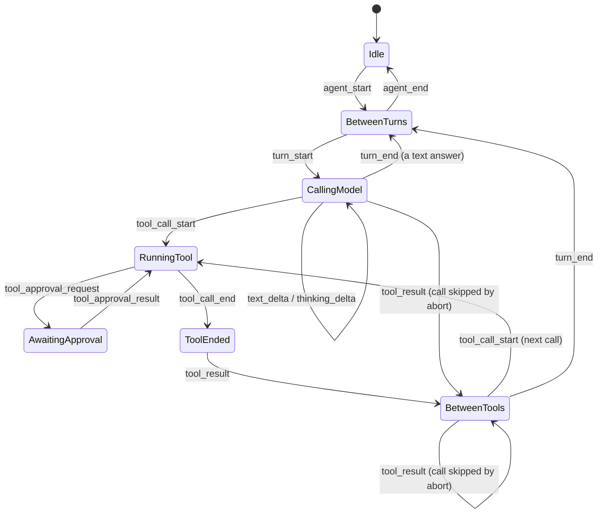

# Day 6 — Read Pi, Design Your Harness

**Phase:** Week 1 — Hello, agent

## By tonight

```
$ node --test tests/event-protocol.test.js
✔ a text-only answer
✔ a tool turn with approval, then the answer
✔ abort mid-tool: the second call is skipped, but still gets its tool_result
✔ maxTurns and errors: agent_end may end the run from any state
✔ events outside the loop are ignored
✔ rejects a tool_result that arrives before its tool_call_end
✔ rejects a second turn that starts while a tool is still running
✔ rejects a trace that never reaches agent_end
✔ advance() throws on an unknown event
ℹ tests 9  ℹ pass 9  ℹ fail 0
```

You have a written design (`docs/architecture.md`) for the real harness, and its heart is **executable**: a state machine that decides whether a sequence of loop events could have come from a correct loop. On Day 14 you run your real loop's traces through it. Tomorrow you start building.

## Why it matters

Your toy works, but you have already noticed what it lacks. Today you read one serious, open-source harness, **Pi**, and decide what yours will look like *before* you write it. Reading a real codebase types-first is a core professional skill. So is deciding what to copy and what not to.

> **Behind?** Day 6 is lighter on purpose: it's the week's slack. If any check from Days 1–5 is red, fix it first: Day 7 builds on the Day 4–5 modules, not on today's notes.

## Concepts

### 1. Read the type surface first

**Types are the map; function bodies are the terrain.** When you open an unfamiliar codebase, don't start reading functions from the top. Start with what the package *offers* and what its data *looks like*. That means its entry file (often `index.ts` or `index.js`), which lists what it exports, and the types those exports use. Once you know the shapes, every function body is easier to read, because you know what goes in and what comes out. When a package ships `.d.ts` files (type declarations), read those first. Pi ships TypeScript sources, so its `index.ts` plays that role.

Pi's agent package starts like this:

```ts
// Core Agent
export * from "./agent.ts";
// Loop functions
export * from "./agent-loop.ts";
…
// Types
export * from "./types.ts";
```

`export * from` re-exports everything another file exports. So this file is a table of contents: the agent, the loop and the types are the three places to read.

**You can already read most TypeScript.** TypeScript is JavaScript with type annotations, and the types use the same language as the JSDoc you wrote on Day 2. A few extra pieces of syntax cover nearly everything you'll meet in Pi. This is Pi's `AgentEvent`, shortened:

```ts
export type AgentEvent =
  // Agent lifecycle
  | { type: "agent_start" }
  | { type: "agent_end"; messages: AgentMessage[] }
  …
  | { type: "tool_execution_end"; toolCallId: string; toolName: string; result: any; isError: boolean };
```

How to read it:
- **`type AgentEvent = A | B | C`** is a *union*: an `AgentEvent` is exactly one of those shapes. Each shape has a `type` field with a fixed string, so code can check `event.type` to know which one it holds.
- **`{ toolName: string; isError: boolean }`** is an object type. TypeScript separates the fields with `;` where JSDoc uses `,`.
- **`AgentMessage[]`** is an array of `AgentMessage`, and **`any`** means "not checked".
- **`name: Type` after a parameter** gives the parameter's type, and **`): Type`** after the parameter list gives the return type.

Put together, here is Pi's `subscribe` method, with its body left out:

```ts
subscribe(listener: (event: AgentEvent, signal: AbortSignal) => Promise<void> | void): () => void
```

From the types alone: `subscribe` takes a listener function. The listener receives an event and an abort signal, and it may return a promise. `subscribe` returns a function, and calling that function unsubscribes. You learned the whole API without reading a line of the implementation. You'll also meet `interface` (another way to name an object type), `?` after a field name (optional), and `<T>` (a type parameter, like a C++ template argument).

### 2. Where things live in Pi

The vendored copy is `reference/pi` (package version 0.80.3). Paths are relative to it:

| What | Where |
|---|---|
| Public surface of the agent package | `packages/agent/src/index.ts` |
| The `AgentEvent` union | `packages/agent/src/types.ts` |
| The `Agent` class, and how listeners `subscribe()` | `packages/agent/src/agent.ts` |
| The low-level loop, and its internal `emit` callback (`AgentEventSink`) | `packages/agent/src/agent-loop.ts` |
| The coding tools (read, bash, edit, write) | `packages/coding-agent/src/core/tools/` |
| Sessions | `packages/coding-agent/src/core/session-manager.ts` and `packages/agent/src/harness/session/` |
| CLI arguments (`Args`, `parseArgs`) | `packages/coding-agent/src/cli/args.ts` |
| Terminal UI library | `packages/tui/src/` (post-course) |

`packages/ai`, `packages/orchestrator` and `packages/pods` exist too. None of them is the loop, so skip them. A big repository rewards a plan: read the files in the table, in 6.2's order, and leave everything else for later.

### 3. Vocabulary differences (know them before you read)

**Pi and this course name events differently.** Pi's `AgentEvent` includes `agent_start`/`agent_end`, `turn_start`/`turn_end`, `message_start`/`message_update`/`message_end` and `tool_execution_start`/`_update`/`_end`. A **different** union, in `packages/agent/src/harness/types.ts`, has hook events named `tool_call` and `tool_result`. Don't merge the two lists.

Ours ([canonical events](README.md#canonical-event-list)) keeps `agent_start`/`agent_end` and `turn_start`/`turn_end`. It streams `text_delta` and `thinking_delta` instead of `message_update`, splits a tool into `tool_call_start` / `tool_call_end` / `tool_result`, and adds approval events.

**The same run, in both vocabularies.** Here is a text-only answer. Pi also announces each whole message, including your prompt, with a start and an end; ours streams the pieces and leaves your message to the UI:

```
Pi (agent-loop.ts)                    ours (Day 12's loop)
agent_start                           agent_start
turn_start                            turn_start
message_start   your prompt
message_end     your prompt
message_start   the reply begins
message_update  × N, as text arrives  text_delta × N  (and thinking_delta)
message_end     the reply is done
turn_end                              turn_end
agent_end                             agent_end
```

Translate while you read, but never "fix" our list to match Pi's. Other days, the course tests and the UI all depend on our names. 6.2 has you work out the tool-call rows yourself.

### 4. What we copy from Pi, and where we differ on purpose

**The same as Pi:**
- **Sessions are an append-only tree** in a JSONL file: every entry has an `id` and a `parentId`, and the conversation the model sees is the path from the root to the current leaf. Pi's own comment above `class SessionManager` in `session-manager.ts` says it in one paragraph. You build this on Day 17, and compaction uses it on Day 25.
- **A run and its turns have lifecycle events** (`agent_start`/`agent_end`, `turn_start`/`turn_end`), and tool results are messages of their own.

"Append-only tree" sounds abstract, so here's a picture. Each entry points at its parent. Going back to an earlier point and asking again adds a new branch; nothing is ever rewritten:

```
a ← b ← c ← d          the conversation so far: a, b, c, d
         ↖
           e           you went back to c and asked again: e's parent is c

leaf = e   →   the model sees a, b, c, e      (d stays in the file, on its own branch)
```

**Different on purpose:**

| | Pi | Ours | Why |
|---|---|---|---|
| **Who hears events** | `Agent.subscribe(listener)`: every listener gets every event of one typed union. Listeners are **awaited** in order, and a run isn't finished until they settle. | A bus with named events (Day 14). `emit` is synchronous and **fire-and-forget**. | Awaiting gives you ordering (a session write finishes before the next turn), but one slow listener stalls the agent. Fire-and-forget never stalls the loop, so anything that needs an *answer*, like approval, is built as request/response on top (Day 20). |
| **Asking before acting** | The core runs tools without asking. A `tool_call` hook (`beforeToolCall`) can block a call with a reason; that is how an extension would add a check. | An approval gate with permission rules in the core, **failing closed**: no approver means deny (Days 12, 20). | This course's learners run small local models on their own machines, so the safe default is built in, not bolted on. |
| **MCP** | Left out deliberately (see Mario Zechner's post). | Added on Day 23. | MCP is now the standard way to plug tools into harnesses. Both choices are defensible: note where you stand. |

**The first row is the deepest difference, so here it is in code.** Pi's `Agent` does, in effect, the first of these; our bus does the second:

```js
for (const listener of listeners) await listener(event);   // Pi: the next turn waits for every listener
for (const listener of listeners) listener(event);         // ours: emit returns at once; nothing waits
```

With the first, a listener that saves the session to disk is guaranteed to finish before the next event, but a listener that hangs hangs the agent. With the second, no listener can slow the loop down, so the loop's timing never depends on who is listening. The price is that an event can't carry an *answer* back. Day 20 builds approval as a request/response on top of the bus for exactly that reason.

### 5. Design vocabulary

**A state machine** lists the *states* a system can be in, the *events* that can happen, and the *transitions*: which event, in which state, leads to which next state. Any event that has no transition from the current state is **illegal**, and the machine rejects it loudly. You have already built one without the name. Day 3's REPL is a state machine:

| State | Event | Next state |
|---|---|---|
| `AtPrompt` | you type a line | `Running` |
| `AtPrompt` | Ctrl+C | `Exited` |
| `Running` | Ctrl+C | `Aborting` |
| `Running` | the run ends | `AtPrompt` |
| `Aborting` | the run ends | `AtPrompt` |

Day 3's toy kept a smaller version of this in one variable: `controller` was `null` at the prompt and set while a run was in flight. Written as data, a state machine becomes a lookup table, and an illegal transition is a missing entry:

```js run
const REPL = Object.freeze({
  AtPrompt: { line: 'Running', ctrl_c: 'Exited' },
  Running: { ctrl_c: 'Aborting', run_end: 'AtPrompt' },
  Aborting: { run_end: 'AtPrompt' },
});

REPL.Running?.ctrl_c               // → 'Aborting'
REPL.AtPrompt?.run_end             // → undefined: no run was going, so "the run ends" is illegal here
```

**An event protocol** is the set of legal orders in which events may appear. Written as a state machine, it becomes a checker you can run against a **trace**: the list of events a real run emitted, in order. Feed the trace to the machine one event at a time. If every step is legal and the machine ends where it started, the trace could have come from a correct loop.

**An event-flow diagram** shows who talks to whom: which component emits an event, and which components hear it (6.3 has one).

**A policy decision** is a choice you write down once, such as "input typed while the agent is busy is *queued*" (Day 15). Writing it down settles the question for every later day, instead of letting it be decided by accident in code.

The diagrams on this page are written in **Mermaid**, a text format for diagrams. GitHub renders it in Markdown files, so your `docs/architecture.md` can contain diagrams that are text, diff-able and easy to edit.

### 6. The loop's event protocol

Day 12's loop emits events in this order (see its pseudocode): `agent_start`, then for each turn `turn_start`, the model's streamed deltas, then for each tool call `tool_call_start` → (approval) → `tool_call_end` → `tool_result`, then `turn_end`; finally `agent_end`. As a state machine:



**One run, step by step.** A question that needs one tool, then gets its answer, walks the machine like this:

| Event | State after it |
|---|---|
| `agent_start` | `BetweenTurns` |
| `turn_start` | `CallingModel` |
| `text_delta` | `CallingModel` |
| `tool_call_start` | `RunningTool` |
| `tool_call_end` | `ToolEnded` |
| `tool_result` | `BetweenTools` |
| `turn_end` | `BetweenTurns` |
| `turn_start` | `CallingModel` (the second turn: the model reads the result) |
| `text_delta` | `CallingModel` |
| `turn_end` | `BetweenTurns` |
| `agent_end` | `Idle` |

The trace ends back in `Idle`, so it's legal. A trace with a `tool_result` *before* its `tool_call_end` is not. The call is answered before it finished, and the machine stops at that event: `illegal transition: BetweenTools --tool_call_end-->`.

Three rules complete it:
1. **`agent_end` may come from any state except `Idle`.** It fires in the loop's `finally`, so an answer, `maxTurns`, an abort and a thrown error all end the run the same way. That's why there is no `Stopped` state: `maxTurns` is a *reason* for `agent_end`, not a place. A run that throws in the middle of a tool still ends `RunningTool --agent_end--> Idle`.
2. **A skipped call has a `tool_result` but no start or end.** After an abort, the loop still answers every call (the tool-pair invariant from Day 3) without running it. That's what the two "skipped by abort" arrows in the diagram are for.
3. **Events outside the loop are ignored** by this machine: `session_*`, `error`, `compaction`, `command_run`, and the UI's events. A `session_start` in the middle of a trace is skipped, not rejected. The machine checks the loop's story, and other components tell their own.

## Build

**Files today:** `notes/day-06.md`, `docs/architecture.md`, `tests/helpers/event-protocol.js` and `tests/event-protocol.test.js`.

### 6.1 Read Pi's design essay — Core

Read Mario Zechner's [What I learned building an opinionated and minimal coding agent](https://mariozechner.at/posts/2025-11-30-pi-coding-agent), the reasons Pi looks the way it does. It's long, so skim for the decisions: tools, permissions, MCP and context. In `notes/day-06.md`, write three ideas you want to keep and one you disagree with.

### 6.2 Map Pi's agent package — Core

Read these, in this order:
1. `packages/agent/src/index.ts`;
2. the `AgentEvent` union in `types.ts`;
3. in `agent.ts`, `subscribe()` and the comment above it;
4. in `agent-loop.ts`, `AgentEventSink`, then follow one turn;
5. `packages/coding-agent/src/core/tools/index.ts`, and the top of `bash.ts`;
6. the comment above `class SessionManager` in `session-manager.ts`;
7. the `Args` type in `src/cli/args.ts`. Compare it with your Day 5 parser.

In your notes, do two things:
- **Draw the call graph** (boxes and arrows are enough): who builds the agent, who receives events, where tools execute, and where the session file is written. For the format, here is your own toy's call graph:

  ```
  main.mjs ──creates──▶ createOllamaClient
  main.mjs ──calls────▶ runTurns ──calls──▶ client.chat ──HTTP──▶ Ollama
                            ├──calls──▶ confirm ──asks──▶ you (readline)
                            └──calls──▶ runTool ──spawns──▶ sh
  ```

- **Fill in an event divergence table** with three columns: *Pi `AgentEvent`*, *our canonical event(s)*, and *why different*. Fill in at least the rows `turn_start`, `message_update`, `tool_execution_start`, `tool_execution_update` and `tool_execution_end`. Add a separate, clearly labelled row for the hook event `tool_call`. Your "why" for `tool_execution_end` should explain why we keep `tool_result` as its own record: the UI shows it, and the [tool-pair invariant](README.md#tool-pair-history-invariant) stores it.

### 6.3 `docs/architecture.md`, first draft — Core

1. **Folders.** Copy the [target tree](README.md#project-structure-target) and write one or two sentences of rationale for each `src/` folder. Say what depends on what, and what must **never** depend on the UI: the loop, the tools and the sessions.
2. **Event flow.** Add this diagram and adjust it to your taste:

   ```mermaid
   flowchart LR
     UI[PromptUI] -->|user_message / abort / command| Bus((EventBus))
     Bus --> Bridge[UIBridge]
     Bridge -->|run msg, history, signal| Loop[AgentLoop]
     Loop --> Provider
     Loop --> Tools[ToolRegistry + builtins]
     Loop -->|events| Bus
     Bus --> UI
     Bridge --> Session[SessionManager]
   ```

   Read it left to right. The UI puts what you type on the bus. The bridge hears it and starts a run on the loop. The loop calls the provider and the tools, and puts its own events on the bus, where the UI hears them and draws them. The bridge also reads the history from the session, and hands it each finished run to save.
3. **The approval pause.** A `needsApproval` tool asks the user and waits. **A timeout or an abort means deny.** A denial is a normal tool result (`User denied bash`), and the loop continues.
4. **The busy policy.** Input typed during a run is **queued** and sent next. (Rejecting it is the acceptable fallback.)
5. **From toy to harness.** Make a table of everything the toy lacks, using your Day 1 notes and today's reading, and the day of this course that builds each item (see the [plan](README.md#the-30-day-plan)). Typical items: a tool registry, file tools with a jail, an approval policy, sessions, events, a real UI, slash commands, compaction, extensions, MCP, settings and evals.
6. **Pi.** List what you copy from Pi and where you differ, using concept 4 and your own reading.

### 6.4 The event protocol, executable — Core

Turn concept 6 into code that tests can import. In `tests/helpers/event-protocol.js`:

```js
/** state → { event → next state }. Fill in every row from the diagram. */
export const TRANSITIONS = Object.freeze({
  Idle: { agent_start: 'BetweenTurns' },
  BetweenTurns: { turn_start: 'CallingModel' },
  // …
});

/**
 * One step: the next state, or throw `illegal transition: <state> --<event>-->`.
 * Handles agent_end specially.
 */
export function advance(state, event) { … }

/**
 * Walk a trace (event names, or { event } objects) from Idle, skipping events the machine doesn't know.
 * → { ok: true, steps } or { ok: false, steps, error }. A trace must end back in Idle.
 */
export function checkTrace(trace) { … }
```

`advance` is concept 5's table lookup, plus rule 1 for `agent_end`. `checkTrace` calls `advance` once per event it knows (rule 3), catches the first illegal step, and finally checks that the machine is back in `Idle`. `steps` records the walk, so a failing test can show how far the trace got. For example, the reference solution returns:

```js
checkTrace(['agent_start', 'turn_start', 'text_delta'])
// → { ok: false,
//     steps: ['Idle --agent_start--> BetweenTurns', 'BetweenTurns --turn_start--> CallingModel',
//             'CallingModel --text_delta--> CallingModel'],
//     error: 'trace ended in CallingModel: agent_end never came' }
```

Then use what you learned yesterday: in `tests/event-protocol.test.js`, write one test per story the loop must be able to tell, and one per story it must never tell. The *By tonight* list shows the nine stories to cover. For example:

```js
test('abort mid-tool: the second call is skipped, but still gets its tool_result', () => {
  const r = checkTrace(['agent_start', 'turn_start',
    'tool_call_start', 'tool_call_end', 'tool_result',   // the call that was running when Ctrl+C came
    'tool_result',                                        // the skipped call: no start, no end
    'turn_end', 'agent_end']);
  assert.equal(r.ok, true, r.error);
});
```

`assert.equal`'s third argument is the message shown when the assertion fails, so a rejected trace reports *why*.

`node --test tests/event-protocol.test.js` passes. Commit `day-06: architecture draft + event protocol`.

### 6.5 Approval traces — Stretch

Add traces for the other approval endings: a denial, a 120-second timeout, and Ctrl+C while the question is open. Each one should still pass through `tool_approval_result` (Day 20's gate emits it itself on timeout and abort, so the UI can close its question). What would go wrong in the UI if it didn't?

### 6.6 Pi's bash tool against yours — Stretch

Read Pi's `bash.ts` past the top. How does it handle output size, timeouts and the processes a command starts? Note one thing to steal for your Day 11 `bash` tool.

## Check

- [ ] `notes/day-06.md`: essay takeaways, the Pi call graph and the divergence table
- [ ] `docs/architecture.md` draft: folder rationale, event flow, approval pause, busy policy, the toy-to-harness table, and Pi copy/differ notes
- [ ] `node --test tests/event-protocol.test.js` passes
- [ ] Commit `day-06: architecture draft + event protocol`

Solution: `tests/helpers/event-protocol.js` and `tests/event-protocol.test.js` in [`solutions/checkpoint-1/`](solutions/checkpoint-1/). The rest of today is your own writing.

## Stuck?

<details><summary>A path in the table above doesn't exist</summary>

Check that you're inside `reference/pi` and that the vendored version is 0.80.3 (`packages/agent/package.json`). If Pi has moved on since, search `packages/agent/src` for `AgentEvent` and note the new path in your notes.
</details>

<details><summary>Pi's TypeScript is hard to follow</summary>

Read the types, not the bodies (concept 1). For syntax you don't recognise, the TypeScript handbook's *Everyday types* page (in Further reading) covers nearly everything Pi uses. When a line still makes no sense, skip it: today you need Pi's shapes and its event order, not every detail.
</details>

<details><summary>How do I write <code>advance</code> without a pile of <code>if</code>s?</summary>

Look the transition up in the table: `TRANSITIONS[state]?.[event]`. If that is `undefined`, throw. (`throw` is not an expression in JavaScript, so you can't write `?? throw …`; use an `if`.) Handle `agent_end` before the lookup.
</details>

<details><summary>My valid "abort" trace is rejected</summary>

A skipped call emits only `tool_result`. It can arrive straight after the model's reply (`CallingModel`) or after another result (`BetweenTools`), and both need a `tool_result` transition.
</details>

<details><summary>A trace that never reaches <code>agent_end</code> is accepted</summary>

Walking every event isn't enough. After the loop, `checkTrace` must check that the state is back to `Idle`, and fail with a message if it isn't.
</details>

<details><summary>My Mermaid diagram shows up as plain text</summary>

The fence must be ```` ```mermaid ````. GitHub renders it. Many editors' Markdown previews need a Mermaid extension, or you can paste the diagram into [mermaid.live](https://mermaid.live/) to check it.
</details>

## Common mistakes

- Copying Pi's vocabulary into your design "because it was right there".
- Reading function bodies first and drowning in detail.
- Designing the pretty terminal UI (themes, raw mode) instead of the loop, its events and its invariants.
- Writing traces for the happy path only. The abort and error traces are the ones that catch bugs.
- Treating `agent_end` like any other transition. A run that ends by `maxTurns` or an error, mid-tool, then looks illegal.

## Self-check

1. Name two `AgentEvent` types Pi emits that our list does not, and say what we emit around a tool call.
2. Pi awaits its event listeners; our bus doesn't. What does each choice buy, and what does it cost?
3. Where does a `needsApproval` tool pause in your protocol, and which event resumes it?
4. Why can a `tool_result` appear without a `tool_call_start` before it?

Answers: [self-check-answers.md](self-check-answers.md#day-6).

## Further reading

- Thorsten Ball, [How to Build an Agent](https://ampcode.com/how-to-build-an-agent): the loop you built on Day 1. Reread it now that you've seen Pi's.
- TypeScript handbook, [Everyday types](https://www.typescriptlang.org/docs/handbook/2/everyday-types.html): enough to read Pi's code. [TypeScript for JavaScript programmers](https://www.typescriptlang.org/docs/handbook/typescript-in-5-minutes.html) is a shorter start.
- Anthropic, [Building effective agents](https://www.anthropic.com/engineering/building-effective-agents): workflows versus agents, and when a simple loop is the right answer.
- Mermaid, [state diagrams](https://mermaid.js.org/syntax/stateDiagram.html) · [flowcharts](https://mermaid.js.org/syntax/flowchart.html): the syntax of this page's diagrams.

---
← [Day 5](day-05.md) · [Curriculum home](README.md) · Next: [Day 7 — Wire formats and message schemas](day-07.md) →
