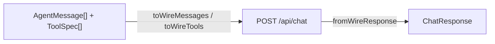

# Day 8 — `OllamaProvider`: Translation, Errors and the Real Context Limit

**Phase:** Week 2 — Provider & tools

## By tonight

```
$ node scripts/smoke-provider.js
✔ plain chat: "four" (22 prompt tokens)
✔ tool call: call_lrd4iwqx bash {"command":"ls -la /tmp"}
✔ model info: max 262144, using 8192, capabilities completion,vision,tools,thinking
✔ wrong model → "ollama pull" hint
✔ abort → AbortError
```

`src/provider/ollama.js` turns harness messages into Ollama requests, and Ollama JSON into a `ChatResponse`. It always asks for a real context window, it knows the window it will *actually* get, and it fails with sentences a human can act on.

## Why it matters

From today, nothing above `src/provider/` ever sees an Ollama field name. That boundary is what makes Day 21's second provider a one-file job. And "TypeError: fetch failed" is not an error message. *"Cannot reach Ollama at http://localhost:11434 — is Ollama running? (`ollama serve`)"* is.

## Concepts

### 1. The provider is a translator

**It translates in both directions.** On the way out, it turns the harness's messages and tools into an Ollama request. On the way back, it turns Ollama's JSON into a `ChatResponse`, the harness's own shape (Day 7's schemas):



**Keep the translation in pure functions.** A *pure* function's result depends only on its arguments: it doesn't fetch, read files, or remember anything between calls. Keep the mapping in **pure exported functions**: `toWireMessages`, `toWireTools`, `fromWireResponse` and `fromWireToolCall`. Pure functions are trivial to test, because a test calls them with data and checks the data that comes back, with no server and no fakes. The class does the I/O (the HTTP requests and the error handling) around them.

Here is Day 7's conversation going out through `toWireMessages`:

```js
toWireMessages([
  { role: 'user', content: 'What files are in /tmp?' },
  { role: 'assistant', content: '',
    toolCalls: [{ id: 'call_1', name: 'bash', arguments: { command: 'ls /tmp' } }] },
  { role: 'tool_result', toolCallId: 'call_1', toolName: 'bash',
    content: 'a.txt\nb.txt', isError: false },
])
// → [
//     { role: 'user', content: 'What files are in /tmp?' },
//     { role: 'assistant', content: '',
//       tool_calls: [
//         { id: 'call_1', function: { index: 0, name: 'bash', arguments: { command: 'ls /tmp' } } },
//       ] },
//     { role: 'tool', content: 'a.txt\nb.txt', tool_name: 'bash', tool_call_id: 'call_1' },
//   ]
```

And the course's `chat-tools.json` capture (Day 7) coming back through `fromWireResponse`:

```js
fromWireResponse(capture, 'qwen3.5:4b')
// → {
//     content: '',
//     toolCalls: [{ id: 'call_tgzmiyhh', name: 'bash', arguments: { command: 'ls -la /tmp' } }],
//     model: 'qwen3.5:4b',
//     finishReason: 'tool_calls',
//     thinking: 'The user wants me to use the bash tool twice …',
//     usage: { promptTokens: 302, completionTokens: 178 },
//   }
```

Everything Ollama-specific is gone: `function` nesting, `done_reason`, `prompt_eval_count`. Notice `finishReason: 'tool_calls'`, even though the wire said `"stop"` (Day 7): the provider decides it from the calls themselves.

### 2. Every request carries `num_ctx` and `num_predict`, and `think` when the model can use it

One method builds every request body, so no request can forget a setting:

```js
buildRequest(messages, tools, { stream }) {
  const body = {
    model: this.model,
    messages: toWireMessages(messages),
    stream,
    options: { num_ctx: this.contextWindow, num_predict: this.maxOutputTokens },
  };
  if (this.think !== undefined && !this.#noThink.has(this.model)) body.think = this.think;
  if (tools?.length) body.tools = toWireTools(tools);
  return body;
}
```

For a plain question, with the defaults, it produces:

```js
{
  model: 'qwen3.5:4b',
  messages: [{ role: 'user', content: 'hi' }],
  stream: false,
  options: { num_ctx: 8192, num_predict: 8192 },
  think: true,
}
```

What each setting is for:
- **`num_ctx`** asks for the context window. Without it, Ollama runs with its own small default and silently drops the start of a long prompt (Day 7).
- **`num_predict` caps the reply** (default: the context window). Ollama's own default is *unlimited*: when the window fills, it shifts the context and keeps generating. A model that runs away never stops. We watched `llama3.2:1b` go past 5 minutes, until Node's `fetch` gave up (concept 4).
- **`think`** asks a thinking model to reason before answering (Day 4). `#noThink` is the set of models that have rejected `think` (concept 4). The course model thinks, so normally `think` is always sent.
- **`tools`** is left out entirely when there are none, rather than sent as an empty list.

`#noThink` is a private field (Day 2): a `Set` of model names, which only the class's own methods can see.

### 3. Arguments become an object at the boundary, and never later

**Parse once, at the edge.** Day 7 showed that one server sends arguments as an object and another as a JSON string. `parseArguments(raw)` lives in `src/provider/parse-arguments.js`, and it makes them all the same:
- an object passes through;
- a string is parsed **once**;
- broken JSON **never throws**. It returns `{ arguments: {}, parseError: '…' }`, so Day 12's loop can tell the model *"your arguments were invalid, retry"* instead of crashing.

```js
parseArguments({ command: 'ls' })     // → { arguments: { command: 'ls' } }
parseArguments('{"command":"ls"}')    // → { arguments: { command: 'ls' } }
parseArguments('{"command": "ls"')
// → { arguments: {}, parseError: 'arguments are not valid JSON (…)' }
parseArguments('[1,2]')
// → { arguments: {}, parseError: 'arguments must be a JSON object, …' }
```

The wording of `parseError` is yours to choose. What matters is that it says what was wrong, because the model reads it. Broken arguments come from the model, so they are an operational error (Day 5): a result to report, not a reason to crash. Day 9 writes the policy, and Day 12's loop carries it out.

**Every call needs an id.** The harness pairs each tool result with its call by `id` (Day 7). Keep the server's `id`, or generate `call_<random>` with `crypto.randomUUID()` when it's missing:

```js
fromWireToolCall({ function: { name: 'bash', arguments: { command: 'ls' } } })
// → { id: 'call_d6a623d1', name: 'bash', arguments: { command: 'ls' } }   (random each time)
```

### 4. Error taxonomy

**Two ways a request can fail.** Either `fetch` rejects, so no response arrived at all (the server is down, or the wait was too long). Or `fetch` resolves with a response whose `ok` is `false`, so the server answered with an error status. Day 3 showed that an HTTP error status alone never makes `fetch` reject. The provider checks both paths, and turns each failure into a `ProviderError` (Day 5) whose `kind` says what happened and whose message says what to do:

| Failure | How you detect it | What the provider does | Message must mention |
|---|---|---|---|
| Server down | `fetch` rejects; `err.cause?.code === 'ECONNREFUSED'` | `ProviderError` kind `unreachable` | `ollama serve` |
| No answer in 5 minutes | `fetch` rejects; `err.cause?.code === 'UND_ERR_HEADERS_TIMEOUT'` (Node waits at most 300 s for the headers, and a non-streaming reply sends them only at the end) | kind `bad_response` | that the model may still be generating; lower `maxOutputTokens`, stream, or use a faster model |
| Unknown model | HTTP 404, or the body says "not found" | kind `model_not_found` | `ollama pull <model>` |
| Garbage body | not JSON, or no `message` object | kind `bad_response` | what *did* arrive (its keys) |
| Other HTTP | `!res.ok` | kind `http` | the status and a body excerpt |
| A model that can't think | HTTP 400, body says `does not support thinking` | **not an error**: add the model to `#noThink`, warn once, retry without `think` | (the warning) |
| A model glitch | HTTP 500, body says `error parsing tool call` or `token repeat limit reached` | kind `bad_response`: the *model's* output was unusable, not the server | the model's name, and "ask again, rephrase, or use a stronger model" |
| **Abort** | `err.name === 'AbortError'` | none: **rethrow it untouched** | — |

This is what the user sees for each kind, from the reference solution:

```
unreachable      Cannot reach Ollama at http://localhost:11434 — is Ollama running? (`ollama serve`)
model_not_found  Model 'nope' not found — try `ollama pull nope`
bad_response     Unexpected response from Ollama: received an object with keys [hello] (expected "message")
http             Ollama answered HTTP 500: {"error":"llama runner process has terminated"}
```

**Abort is not a failure.** It's the user's choice, and Day 13 treats it as a clean stop. If the provider wrapped it in a `ProviderError`, every Ctrl+C would print "the provider failed".

**The 5-minute row needs a closer look.** A non-streaming reply arrives all at once, so Ollama sends the response headers only when the model has finished. Node's `fetch` waits at most 300 seconds for headers. So a long generation looks exactly like a network failure, `fetch failed`, after five minutes, even though the server is fine. Its `err.cause.code` tells them apart. `num_predict` (concept 2) and streaming (Day 16) are the real fixes.

**Matching text, once.** The thinking and glitch rows are the one place the provider matches the server's *text*: Ollama gives those errors no code. It happens once, at the boundary, and turns into state (`#noThink`) or a precise error kind, so nothing above the provider ever routes on message text.

**Why no automatic retry for a glitch?** Sampling is random, so "just ask again" sounds right. We measured it on `qwen2.5:0.5b`: the two glitches it met both came straight back on the retry, which doubled the wait for nothing. Measure before you add a retry (Stretch 8.5).

### 5. `getModelInfo()`: the window you will really get

**Read the model's maximum from `/api/show`.** `POST /api/show` returns `model_info` with a key ending in `.context_length`. Its prefix depends on the model family (`qwen35.`, `llama.`, `gemma3.`), so **match by suffix**:

```js
const info = { 'general.architecture': 'qwen35', 'qwen35.context_length': 262144 };   // from /api/show
const key = Object.keys(info).find((k) => k.endsWith('.context_length'));
key                                     // → 'qwen35.context_length'
info[key]                               // → 262144
```

**The usable window is the smaller of two numbers:** what you *ask for* (`num_ctx`) and what the model *supports*. Return:

```js
{
  name,
  maxContext,     // from /api/show, or null
  contextLimit,   // = min(this.contextWindow, maxContext): what budgets use
  capabilities,   // e.g. ['completion', 'tools', 'thinking']
}
```

For the course model with the default window, that's `maxContext: 262144` and `contextLimit: 8192`: the *By tonight* line "max 262144, using 8192". A model trained for only 4096 tokens, asked for 8192, gets `contextLimit: 4096`. Budgeting against the bigger number would let the conversation grow past what the server can really hold.

If there is no `context_length` key, call `onWarn(…)` loudly and use `contextWindow`. A silent guess here quietly breaks compaction on Day 25.

## Build

**Files today:** `src/provider/parse-arguments.js`, `src/provider/ollama.js` and `scripts/smoke-provider.js`.

### 8.1 Mapping functions — Core

Write `src/provider/parse-arguments.js` (`parseArguments`), then these in `src/provider/ollama.js`:

```js
// the table you filled in on Day 7
export function toWireMessages(messages) { … }

// ToolSpec → { type: 'function', function: { name, description, parameters } }
export function toWireTools(tools) { … }

// keep the id or generate one; parseArguments(tc.function.arguments)
export function fromWireToolCall(tc) { … }

export function fromWireResponse(body, fallbackModel) { … }
```

Rules for `toWireMessages`:
- `assistant` messages send `thinking` (if any) and `tool_calls: [{ id, function: { index, name, arguments } }]`;
- `tool_result` becomes `{ role: 'tool', content, tool_name, tool_call_id }`.

Rules for `fromWireResponse`:
- `finishReason` is `'tool_calls'` when there are calls, otherwise `done_reason`;
- `usage = { promptTokens: prompt_eval_count, completionTokens: eval_count }`.

A `switch` on `m.role` keeps `toWireMessages` readable: one `case` per role, returning the wire shape for that role.

### 8.2 The class — Core

```js
export class OllamaProvider {
  #noThink = new Set();   // models that rejected `think`

  constructor({
    baseUrl = DEFAULT_OLLAMA_URL,
    model = DEFAULT_MODEL,
    contextWindow = DEFAULT_CONTEXT_WINDOW,
    maxOutputTokens = contextWindow,
    think = true,
    fetch = globalThis.fetch,
    onWarn = (m) => console.warn(m),
  } = {}) { … }

  async chat(messages, tools, { signal } = {}) { … }   // #postChat, then fromWireResponse
  async getModelInfo(name = this.model) { … }          // POST /api/show
  setModel(name) { … }                                 // provider config only
  buildRequest(messages, tools, { stream }) { … }
}
```

Notice `maxOutputTokens = contextWindow`: a default can refer to a parameter listed before it. `setModel` changes only the provider's own setting, because the loop never holds a model name.

Put the error handling in three private helpers:
- `#post(path, body, signal)` maps failures to `ProviderError`s (concept 4);
- `#readJson(res)` turns non-JSON into `bad_response`;
- `#postChat(messages, tools, { stream }, signal)` calls `#post`. If the error says `does not support thinking`, it adds the model to `#noThink`, calls `onWarn`, and retries once. If it names a model glitch, it throws a `bad_response` instead.

The shape of `#post`, in outline:

```js
let res;
try {
  res = await this.fetch(url, { method: 'POST', body: JSON.stringify(body), signal });
} catch (err) {
  if (isAbortError(err)) throw err;              // Ctrl+C: pass it through untouched
  // no response at all: look at err.cause?.code (concept 4's first two rows)
}
if (!res.ok) {
  // the server answered with an error: read the body text, then model_not_found or http
}
return res;
```

`fetch` is **injected** (Day 5's pattern), which is how the course tests fake every failure without a server.

### 8.3 Course tests — Core

Copy `course-tests/day-08/` and make it pass. It covers:
- the request body (`num_ctx`, `num_predict`, `think`, tool wrapping);
- the mapping table in both directions, id handling, and string and broken arguments;
- all four error kinds, the 5-minute timeout, abort pass-through, the thinking fallback, and model glitches against server faults;
- `getModelInfo`: min/max and the warning.

### 8.4 Live smoke — Core

`scripts/smoke-provider.js` is a plain script (`node:assert/strict`, non-zero exit on failure). It lives **outside** `src/` because it is never shipped. It checks:
1. plain chat → non-empty `content`, and a `finishReason`;
2. a forced tool call (`"What files are in /tmp? Use the bash tool."`) → `toolCalls[0]` has an `id`, the name `bash`, and object arguments. **Assert structure, never wording.** Small models sometimes answer in prose instead, so retry once and *print* that it happened;
3. `getModelInfo()` → print the maximum against the window used;
4. `model: 'definitely-not-a-model'` → the error message mentions `ollama pull`;
5. abort after 50 ms → `AbortError`.

Each check is a few lines: call the provider, assert, print a `✔` line. A failed `assert` throws, and an uncaught error ends the script with a non-zero exit code. The first one looks like this:

```js
const plain = await provider.chat([{ role: 'user', content: 'What is 2+2? Answer with one word.' }], []);
assert.ok(typeof plain.content === 'string' && plain.content.length > 0, 'non-empty content');
assert.ok(plain.finishReason, 'finishReason present');
console.log('✔ plain chat:', JSON.stringify(plain.content),
  `(${plain.usage?.promptTokens} prompt tokens)`);
```

Run `node scripts/smoke-provider.js`. Then stop Ollama and run it again: you should see the *ollama serve* message. Commit `day-08: OllamaProvider`.

### 8.5 Retry with backoff — Stretch

Add an optional `retries` option: retry `unreachable` and HTTP 5xx server faults up to N times, with exponential backoff (`200 ms × 2^attempt`). The backoff wait must be **abortable**. Never retry `model_not_found` or `bad_response`. Write a test with a fake `fetch` that fails twice and then succeeds. Then measure: does a retry ever rescue a real failure on your machine? Keep it only if it does.

## Check

- [ ] `node --test tests/course/day08-*` green (20 tests)
- [ ] `node scripts/smoke-provider.js` passes against live Ollama, and prints the *ollama serve* hint when Ollama is stopped
- [ ] No Ollama field name appears outside `src/provider/`: `grep -rn "done_reason\|prompt_eval_count\|tool_name" src --include='*.js' | grep -v provider/` prints nothing
- [ ] Commit `day-08: OllamaProvider`

Solution: `src/provider/ollama.js`, `parse-arguments.js` and `scripts/smoke-provider.js` in [`solutions/checkpoint-1/`](solutions/checkpoint-1/).

## Stuck?

<details><summary>Where is <code>ECONNREFUSED</code> hiding?</summary>

Node's `fetch` rejects with `TypeError: fetch failed`. The useful part is on `err.cause.code`: on macOS, `err.cause` is an `AggregateError` (one attempt for IPv4, one for IPv6) whose `code` is `ECONNREFUSED`. Log `err.cause` once to see it.
</details>

<details><summary>The 404 test passes, but the live wrong-model check doesn't</summary>

Some Ollama versions return the model-not-found error with a different status. Match on the body text too (`/not found/i`), as the reference does.
</details>

<details><summary>My abort test hangs</summary>

Your fake `fetch` must listen for `init.signal`'s `abort` event and reject. Real `fetch` does this for you; a fake has to do it itself.
</details>

<details><summary>Every request fails with HTTP 400 "does not support thinking"</summary>

Your model has no thinking capability, and the retry isn't happening. Check that `#postChat` catches the `ProviderError`, tests its message, adds the model to `#noThink`, and that `buildRequest` leaves `think` out for models in that set.
</details>

<details><summary>"fetch failed" after exactly 5 minutes</summary>

Node's `fetch` waits at most 300 s for response headers, and a non-streaming reply sends them only when generation ends. The model was still generating. Map `UND_ERR_HEADERS_TIMEOUT` to a clear error, send `num_predict` so generation ends, and prefer streaming (Day 16) for long answers.
</details>

<details><summary>HTTP 500 "token repeat limit reached" or "error parsing tool call"</summary>

The model's output went wrong: it got stuck repeating itself, or wrote a tool call Ollama couldn't parse. It's common with very small models (1B and below). Ask again or rephrase. If it keeps happening, use the course model.
</details>

<details><summary><code>SyntaxError: Private field '#noThink' must be declared in an enclosing class</code></summary>

A private field has to be declared in the class body before any method uses it: `#noThink = new Set();` at the top of the class. Assigning `this.#noThink = …` in the constructor isn't enough on its own.
</details>

## Common mistakes

- Wrapping `AbortError` in a `ProviderError` ("the provider failed"). Abort isn't a failure.
- Hard-coding `llama.context_length` (your model's key is `qwen35.context_length`).
- Asserting on the model's prose in smoke tests.
- Throwing on broken tool arguments, or parsing them again later "to be safe". Parse once, at the boundary, and report a `parseError`.
- Budgeting against the model's maximum (262144) when the server runs with your `num_ctx` (8192).

## Self-check

1. Why is `{ signal }` part of `chat()`'s signature from the first commit, instead of something added later?
2. Where does a string `arguments` payload become an object, and what happens if it is broken JSON?
3. Name the error kinds and what each message tells the user.
4. Why is `contextLimit` the *minimum* of two numbers?

Answers: [self-check-answers.md](self-check-answers.md#day-8).

## Further reading

- MDN, [`Response`](https://developer.mozilla.org/en-US/docs/Web/API/Response) · [`Error.cause`](https://developer.mozilla.org/en-US/docs/Web/JavaScript/Reference/Global_Objects/Error/cause) · [Private class fields](https://developer.mozilla.org/en-US/docs/Web/JavaScript/Reference/Classes/Private_properties)
- Node.js, [`crypto.randomUUID()`](https://nodejs.org/api/crypto.html#cryptorandomuuidoptions)
- Ollama, [Show model details](https://docs.ollama.com/api-reference/show-model-details) · [Errors](https://docs.ollama.com/api/errors) · [Thinking](https://docs.ollama.com/capabilities/thinking) · [Modelfile parameters](https://docs.ollama.com/modelfile) (`num_ctx`, `num_predict` and the rest of `options`)

---
← [Day 7](day-07.md) · [Curriculum home](README.md) · Next: [Day 9 — Tool contracts and the registry](day-09.md) →
