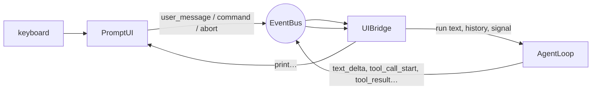

# Day 15 — Talk to Your Harness: `PromptUI` + `UIBridge` ⚠ heavier day

**Phase:** Week 3 — Interactive harness

## By tonight

```
$ node src/cli/main.js
  · agent-harness · qwen3.5:4b · /Users/you/agent-harness
  · Ctrl+C aborts a run (twice exits) · /quit leaves
> How many files are in the toy folder? Use bash.
  ⚙ bash {"command":"find toy -type f | wc -l"}
  allow bash {"command":"find toy -type f | wc -l"}? [y/N] y
  · ✓        5
agent> There are **5** files in the `toy` folder.
> what about src?          ← it remembers the conversation
```

**You are chatting with the harness you built.** It has a prompt, tool calls you approve, Ctrl+C that stops a run without killing the program, and messages typed while it's busy that wait their turn.

## Why it matters

Until now you drove the engine from scripts. Interactive use brings timing problems that scripts never hit:
- who reads the keyboard while a run is in flight;
- what happens to a line typed mid-run;
- how the prompt comes back after an error.

Getting these right is the difference between "it works" and "I'd actually use it."

## Concepts

### 1. Exactly one owner of stdin

**Whoever reads the keyboard owns it.** Your keystrokes reach the program through *standard input* (stdin), one stream for the whole process. `readline` takes over stdin. A second reader (`process.stdin.on('data')`, a second `readline`, or `rl.question` called from deep in the loop) fights it for keystrokes.

Here is what that fight looks like. The main readline turns each line into a message. An approval prompt makes a readline of its own on the same stream and asks its question. You type `y`:

```js
const main = readline.createInterface({ input });
main.on('line', (line) => sendToModel(line));
const second = readline.createInterface({ input });   // ✗ a second owner, for the approval
const answer = await second.question('allow bash? [y/N] ');
// answer is 'y', and main's 'line' handler ALSO got 'y': a message "y" just went to the model
```

Both readers saw the same line. **`PromptUI` is the only owner.** When anything else needs input (an approval today, the `/resume` picker on Day 19, the trust prompt on Day 22), it calls `ui.ask(question)`, which uses the *same* readline. While a question is pending, readline delivers the answer to that question and **not** as a `'line'` event:

```js
const rl = readline.createInterface({ input });
rl.on('line', (line) => sendToModel(line));
const answer = await rl.question('allow bash? [y/N] ');   // ✓ the same readline
// answer is 'y', and the 'line' handler never saw it; the next line you type goes to it as usual
```

### 2. The split of responsibilities

**Three components, each with one job.** Today's pieces connect through the bus from Day 14:



- **PromptUI**: input and output only. Lines become events; it can print and ask. It has no idea what an agent is.
- **UIBridge**: translates between the bus and the UI, and holds **one piece of state: busy** (plus the queue that implies).
- **AgentLoop**: unchanged. It just emits.

**One message, end to end.** Follow *By tonight*'s first question through the diagram:
1. You press Enter. `PromptUI` emits `user_message { content }`.
2. The bridge hears it, marks itself busy, and calls `loop.run(content, history, { signal })`.
3. The loop emits `tool_call_start`; the bridge tells the UI to print `⚙ bash {…}`.
4. The loop asks for approval. The approver calls `ui.ask(…)`, and you answer `y` on the same readline.
5. The loop emits `tool_result`; the bridge prints `· ✓ 5`.
6. The loop returns its result; the bridge prints the answer, saves the run to history, clears busy, and shows the prompt.

Because the UI knows nothing about agents and the loop knows nothing about terminals, you can test each one alone: a fake UI drives the bridge, and a fake provider drives the loop.

### 3. Policies, decided

**A policy is a question answered once, so code doesn't answer it by accident.** Four of them shape today's UI:
- **Ctrl+C:** while busy, the **first press aborts the run and drops anything queued** (printing what wasn't sent), and a second press exits. While idle it exits **130** (128 + SIGINT, the Unix convention). The first Ctrl+C kills the work, not the session. If the queue survived, the next message would start at once, and "press Ctrl+C again to exit" would abort *it* instead: one press per queued message.
- **Busy input is queued.** A line typed during a run is printed as `queued (1 waiting)` and runs when the current one finishes, in order. Rejecting it ("busy — try later") is the acceptable fallback; dropping it silently is not.
- **A command is `/` and a name.** `/help` and `/model 2` are commands. `/Users/me/app.js why does this crash?` is a **message** that starts with a path, which is exactly what dragging a file into a terminal types. The rule: `/`, a letter, then letters, digits, `_` or `-`, ending at a space or the end of the line. Day 18's parser uses the same rule.
- **One line per Enter.** A terminal submits on Enter; there is no Shift+Enter without raw mode. Multi-line input arrives on Day 28 as a `<<<` sentinel.

**The command rule on some real lines** (from the reference `PromptUI`):

| Line | Becomes |
|---|---|
| `/help` | a command |
| `/model 2` | a command |
| `/Users/me/app.js why does this crash?` | a message: after `/Users` comes `/`, not a space |
| `/2fa codes?` | a message: a digit follows the `/` |
| `hello /quit` | a message: it doesn't start with `/` |

**The Ctrl+C policy, as you'll see it.** You send a long request, type a second message while it runs, then press Ctrl+C twice. The reference harness prints:

```
  · queued (1 waiting)
  · not sent (1 queued): "and a short poem"
  · aborting — press Ctrl+C again to exit
  · aborted
```

…and the second press exits with code 130. (Day 3 explained 130: 128 plus 2, SIGINT's number.)

### 4. Every run ends through one teardown

**Three endings, one exit path.** A run ends in one of three ways: an answer, an abort, or an error. Each one must:
- clear the busy flag;
- restore the `> ` prompt **exactly once**;
- start the next queued message.

Put that in **one** `#teardown()` method called from `finally`. The classic bug is restoring the prompt only on success, which leaves a terminal that looks alive but ignores you after an error.

```js
async #run(content) {
  this.busy = true;
  try {
    const result = await this.loop.run(content, this.getHistory(), { signal: this.controller.signal });
    // print the answer, record the run
    this.ui.showPrompt();        // ✗ only reached when nothing threw
  } catch (err) {
    // print the error
  } finally {
    this.#teardown();            // ✓ runs after an answer, an abort and an error alike
  }
}
```

`finally` (Day 5) is what makes "exactly once" easy: whichever way the `try` ends, the teardown runs once.

### 5. History lives in the bridge (for now), and every run leaves a record

**What the model remembers is what the bridge keeps.** The bridge keeps `history` and passes it to `loop.run(text, history, { signal })`. On Day 17 the session file takes over, through the `getHistory()` and `onRunComplete()` hooks. What a run adds depends on how it ended:

| The run… | It adds to history |
|---|---|
| answered | `result.newMessages` |
| was aborted | `result.newMessages`, then `{ role: 'user', content: '[Request interrupted by user]' }` |
| failed after a tool ran | the messages the loop's error carries (`err.newMessages`) |
| failed before anything happened | nothing: the error is on screen, and you can send the message again |

**Why the note?** Without it the model sees an unfinished task, and it can pick that task up again on your next message, whatever you asked. Claude Code adds the same words. Stretch 15.7 measures how much the note helps.

**Why keep a failed run?** Say `write` created a file and then Ollama went away. If history drops that run, the model believes nothing happened. One small change to the loop fixes it: `run()` catches, sets `err.newMessages`, and rethrows. Wherever it can throw, those messages are whole units (the user message, then complete tool pairs), so the [tool-pair invariant](README.md#tool-pair-history-invariant) still holds.

With the reference harness, a run whose `write` succeeded before the provider failed shows:

```
  ⚙ write {}
  · ✓ Created notes.txt (5 bytes).
error> Cannot reach Ollama at http://localhost:11434 — is Ollama running? (`ollama serve`)
```

…and afterwards the history holds `user`, `assistant` (the `write` call) and `tool_result`. Next time, the model knows the file exists. A run that failed before doing anything leaves the history empty.

## Build

### 15.1 `src/ui/prompt-ui.js` — Core

```js
export class PromptUI {
  constructor({
    input = process.stdin,
    output = process.stdout,
    printer,
    bus,
    prompt = '> ',
    terminal,
    onExit,
  }) { … }
  // readline/promises createInterface;
  // 'line' → #onLine; 'SIGINT' → handleInterrupt(); 'close' → onExit(0)
  start() { … }
  stop() { … }             // close readline (safe twice) — without this the process never exits
  setBusy(busy) { … }
  showPrompt() { … }       // re-pose '> ' (not while busy)
  ask(question, { signal }) { … }   // → Promise<string> via rl.question — the shared primitive
  handleInterrupt() { … }  // Ctrl+C policy; public so tests can call it without a terminal
  printAssistant(t) / printTool(name, t) / printSystem(t) / printError(t)
  writeChunk(text, kind) / endStream()   // for Day 16 streaming
}
```

`#onLine(raw)`: trim it. A blank line just re-prompts. A line that follows the command rule (concept 3) emits `command { line }`; anything else emits `user_message { content }`. Import from **`node:readline/promises`** so `rl.question` returns a promise.

Some hints:
- **The command rule** fits in one regular expression anchored at the start (`^/`). Test it on every line of concept 3's table before you wire it in.
- **`handleInterrupt`** needs to count presses during a run, so `setBusy` resets the count whenever a run starts or ends.
- **`onExit`** is injected, so a test can record the exit code instead of ending the test process.
- **`terminal`** defaults to whether `output` is a TTY (Day 14). Tests pass `terminal: false` and plain streams.

### 15.2 `src/bridge.js` and one loop change — Core

```js
export class UIBridge {
  // subscribes on construction
  constructor({ bus, loop, ui, getHistory, onRunComplete, onCommand }) { … }
  submit(content) { … }   // busy → queue + "queued (n waiting)"; else #run
  abort() { … }           // controller?.abort()
  whenIdle() { … }        // Promise: resolves when not busy and queue empty (tests, /quit)
  dispose() { … }         // unsubscribe everything
}
```

- `#run(content)`: busy = true, `ui.setBusy(true)`, a fresh `AbortController`. Then `await loop.run(content, getHistory(), { signal })`, hand the run's record (concept 5) to `onRunComplete`, and print the answer (plus `aborted` or the warning).
- `catch`: emit `error` and print it. If `err.newMessages` holds more than the user message, hand those to `onRunComplete` too.
- `finally`: `#teardown()`.
- `abort()`: drop the queue first, printing what wasn't sent (`not sent (2 queued): "two", "three"`), then abort the controller.
- In `AgentLoop.run`, add `catch (err) { err.newMessages = newMessages; throw err; }` before the `finally` (concept 5).
- Subscriptions:
  - `user_message` → `submit`;
  - `abort` → `abort()`;
  - `command` → `onCommand(line)` (for today, only `/quit`; the rest arrive on Day 18);
  - `tool_call_start` → `ui.printTool(name, oneLine(args))`;
  - `tool_result` → `ui.printSystem('✓ …' or '✗ …')`;
  - plus `text_delta`/`thinking_delta` → `ui.writeChunk`, ready for tomorrow.

`oneLine(text)` is a small helper: the first line of the text, cut to about 120 characters, so a long tool result shows as one line. In `#teardown`, start the next queued message with `setImmediate(() => this.#run(next))` rather than calling it directly. Then each run starts fresh on the event loop, instead of nesting inside the one that just finished. `whenIdle()` keeps a list of waiting `resolve` functions and calls them when the queue is empty: tests `await bridge.whenIdle()` instead of guessing how long to sleep.

### 15.3 `src/app.js` and `src/cli/main.js` — Core

`createApp({ cwd, provider, input, output, terminal, color, onExit, streaming })` builds the bus, registry (builtins), printer, ui, loop and bridge, and returns `{ …, start(), stop(code) }`. Today's approver goes **through the UI**:

```js
const approve = async (call, tool, { signal }) => {
  const question = `  allow ${call.name} ${JSON.stringify(call.arguments)}? [y/N] `;
  const answer = await ui.ask(question, { signal });
  return answer.trim().toLowerCase() === 'y';
};
```

`src/cli/main.js` starts with `#!/usr/bin/env node`, then `createApp().start()`. It grows into the real CLI on Day 26.

The first line, `#!/usr/bin/env node`, is a *shebang*. It tells the operating system which program runs the file when you execute it directly, as `./src/cli/main.js` or, from Day 26, as the `agent-harness` command. `node src/cli/main.js` ignores it. `stop(code)` must undo everything `start()` did (abort the run, unsubscribe the bridge, close readline). Otherwise something still holds the event loop, and the process never exits.

### 15.4 Course tests — Core

Copy `course-tests/day-15/`. It covers:
- lines → events; Ctrl+C semantics; `ask()` sharing the readline; `stop()`;
- a line that starts with a path is a message;
- the bridge: answer + prompt restored once, **queue order**, abort, an error path that still restores the prompt, history across runs, and tool display;
- Ctrl+C with messages queued, the interruption note, and a run that failed after a tool ran.

### 15.5 Talk to it — Core

`node src/cli/main.js`. Try:
1. a question that needs `bash` (approve it);
2. a follow-up that depends on the first answer;
3. a long request, then Ctrl+C;
4. two quick messages, the second typed while the first runs (it should say `queued`). Do it again and press Ctrl+C: the run stops, the queued message is listed as not sent, and a second Ctrl+C exits;
5. stop Ollama and send a message: you should get a readable error, and the prompt comes back.

Paste the transcript into `notes/day-15.md`. Commit `day-15: interactive harness`.

### 15.6 Status line — Stretch

After each run, print a dim status line: `turns 2 · 1 tool · 412 prompt tokens · 3.4 s`. Take the numbers from `AgentResult` and `Date.now()`.

### 15.7 Does the model know you stopped it? — Stretch

`scripts/interrupt-experiment.js`: build the history of an interrupted request (you asked for a `bash` command, then pressed Ctrl+C at the approval question). Then ask something unrelated, `What is 2+2?`, ten times with the note and ten times without it, and count how often the model goes back to the cancelled task (it calls a tool, or doesn't answer 4).

What we measured on `qwen3.5:4b`, in three batches:

| History | Went back to the cancelled task |
|---|---|
| no note | 4/8, then 2/8, then 4/20 (10 of 36, 28%) |
| with the note | 1/8, then 1/8, then 2/20 (4 of 36, 11%) |

The note helps, but by less than the first batch suggested. 4/8 against 1/8 looked dramatic; the next two batches were much closer. Which batch would you have believed if it had been your only one? Run yours, and write in `notes/day-15.md` how many trials you would want before trusting a difference like this (Day 9's rule of thumb is a start).

## Check

- [ ] `node --test tests/course/day15-*` green (13 tests)
- [ ] You held a real multi-turn conversation, with an approval, an abort and a queued message
- [ ] With Ollama stopped: a readable error, and the prompt returns
- [ ] Commit `day-15: interactive harness`

Solution: `src/ui/prompt-ui.js`, `src/bridge.js`, `src/app.js` and `src/cli/main.js` in [`solutions/checkpoint-2/`](solutions/checkpoint-2/).

## Stuck?

<details><summary><code>rl.question(...).catch is not a function</code></summary>

You imported `node:readline`, whose `question` uses callbacks. Import `node:readline/promises`.
</details>

<details><summary>My answer to an approval also arrives as a message</summary>

Two things are reading stdin (concept 1). Every question must go through `ui.ask()`, on the one readline that `PromptUI` owns. Search your code for other `createInterface` calls and for `process.stdin.on`.
</details>

<details><summary>The process doesn't exit after <code>/quit</code></summary>

readline still holds stdin. `ui.stop()` must call `rl.close()`. Also check for leftover timers.
</details>

<details><summary>The prompt appears in the middle of streamed text</summary>

Don't re-prompt while busy. `showPrompt()` returns early when `this.busy` is true, and the bridge calls it once, in teardown.
</details>

<details><summary>A message typed during a run disappears</summary>

Is `submit()` pushing onto `queue` when busy, and does `#teardown()` shift the next one off and run it?
</details>

<details><summary>After an error, the prompt never comes back</summary>

The prompt is being restored on the success path only. Move it into `#teardown()`, and call that from `finally` (concept 4).
</details>

## Common mistakes

- Calling `rl.question` from the loop or the bridge, creating a second stdin owner.
- Restoring the prompt only after successful runs.
- Exiting on the first Ctrl+C and losing the session.
- Keeping the queue after Ctrl+C, so "press again to exit" aborts the next message instead.
- Saving history only when a run succeeds: when the next model call fails, the agent forgets the file it just wrote.

## Self-check

1. Why must exactly one component own stdin, and how do others get input?
2. What does the first Ctrl+C do during a run, and to the messages waiting in the queue? Why not exit straight away?
3. Where does the busy queue live, and what happens to a line typed mid-run?
4. Name the three ways a run can end, what must happen on each, and what each one leaves in history.

Answers: [self-check-answers.md](self-check-answers.md#day-15).

## Further reading

- Node.js, [`readline/promises`](https://nodejs.org/api/readline.html#promises-api) · [`'SIGINT'` on readline](https://nodejs.org/api/readline.html#event-sigint) · [`setImmediate`](https://nodejs.org/api/timers.html#setimmediatecallback-args)
- [Exit status 130](https://tldp.org/LDP/abs/html/exitcodes.html) (128 + signal number)
- Wikipedia, [Standard streams](https://en.wikipedia.org/wiki/Standard_streams) · [Shebang](https://en.wikipedia.org/wiki/Shebang_(Unix))

---
← [Day 14](day-14.md) · [Curriculum home](README.md) · Next: [Day 16 — Streaming, and Checkpoint 2](day-16.md) →
